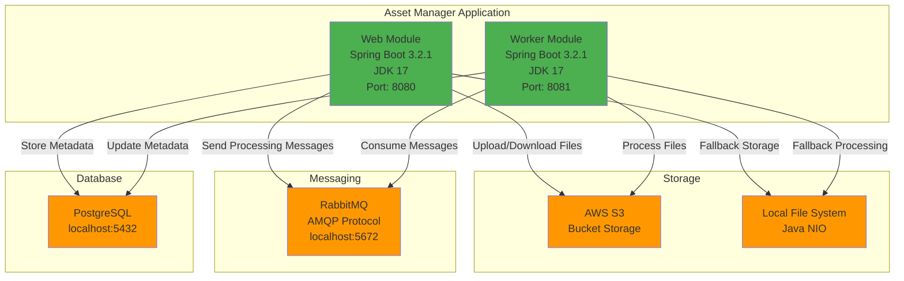
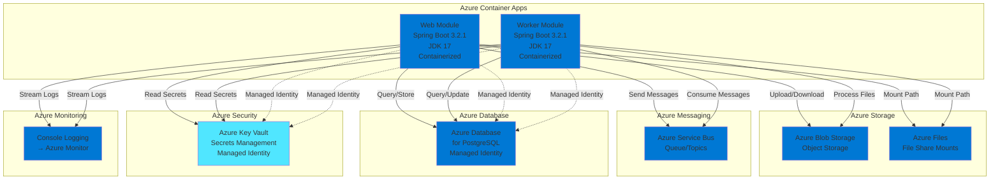

# Modernization Plan

**Branch**: `001-modernization-plan` | **Date**: 2025-12-31 | **Github Issue**: https://github.com/zhiyongli_microsoft/asset-manager/issues/17

---

## Modernization Goal

Migrate the asset manager project to Azure by replacing AWS services with Azure equivalents, securing credentials, and ensuring the application is container-ready and deployable to Azure.

## Scope

This section describes the scope that the modernization plan will cover.

1. Migration To Azure
   - Migrate storage from AWS S3 to Azure Blob Storage [based on the appcat report and project code analysis]
   - Migrate messaging from RabbitMQ to Azure Service Bus [based on the appcat report]
   - Migrate plaintext credentials to Azure Key Vault [based on the appcat report]
   - Migrate local file storage to Azure Storage Account File Share mounts [based on the appcat report]
   - Migrate to Azure Database for PostgreSQL with managed identity [based on the appcat report and user request to migrate to Azure]
   - Migrate logging to console output [based on cloud-native best practices]

2. Containerize the application
   - Generate Dockerfile and related files for container readiness [based on the appcat report indicating no Dockerfile found]

## References

- `https://github.com/zhiyongli_microsoft/asset-manager/issues/17` - Migration issue to be updated

## Application Information

### Current Architecture

**Framework Details:**
- **Language:** Java 17
- **Framework:** Spring Boot 3.2.1, Spring Framework 6.1.x
- **Build Tool:** Maven
- **Key Dependencies:**
  - `spring-boot-starter-web` - REST API and MVC
  - `spring-boot-starter-amqp` - RabbitMQ integration
  - `spring-boot-starter-data-jpa` - Database access
  - `software.amazon.awssdk:s3` - AWS S3 SDK
  - `postgresql` - PostgreSQL JDBC driver
  - `spring-boot-starter-thymeleaf` - Template engine (web module)

**Connector Frameworks:**
- AWS S3: AWS SDK for Java 2.25.13
- RabbitMQ: Spring AMQP
- PostgreSQL: Spring Data JPA with JDBC

**Configuration:**
- Plaintext AWS credentials in `application.properties`
- Plaintext database credentials in `application.properties`
- Plaintext RabbitMQ credentials in `application.properties`

## Clarification

This section is empty as there are no open issues that require clarification. The migration path is clear based on the appcat report and the available solutions in the knowledge base.

## Target Architecture

**Target Framework Details:**
- **Language:** Java 17 (unchanged)
- **Framework:** Spring Boot 3.2.1 (unchanged), Spring Framework 6.1.x (unchanged)
- **Build Tool:** Maven (unchanged)
- **New Azure Dependencies:**
  - `azure-storage-blob` - Azure Blob Storage SDK
  - `azure-messaging-servicebus` - Azure Service Bus SDK
  - `azure-security-keyvault-secrets` - Azure Key Vault SDK
  - `azure-identity` - Managed Identity support
  - Azure Spring Boot Starters for seamless integration

**Connector Frameworks:**
- Azure Blob Storage: Azure SDK for Java with Managed Identity
- Azure Service Bus: Azure SDK for Java (replacing Spring AMQP)
- Azure Database for PostgreSQL: Azure SDK for Java with Managed Identity
- Azure Key Vault: Azure SDK for Java with Managed Identity
- File Storage: Azure Files mounted as volumes

## Task Breakdown

1) Task name: Migrate from AWS S3 to Azure Blob Storage
   - Task Type: Migration To Azure
   - Description: Replace AWS S3 SDK usage with Azure Blob Storage SDK. Update storage configuration, migrate S3Client usage to BlobServiceClient, and update file upload/download/list operations in both web and worker modules.
   - Solution Id: s3-to-azure-blob-storage

2) Task name: Migrate from RabbitMQ to Azure Service Bus
   - Task Type: Migration To Azure
   - Description: Replace RabbitMQ/AMQP integration with Azure Service Bus. Migrate from Spring AMQP to Azure Service Bus SDK, update queue configuration, and migrate message producers and consumers in both modules.
   - Solution Id: amqp-rabbitmq-servicebus

3) Task name: Migrate local file storage to Azure Storage Account File Share mounts
   - Task Type: Migration To Azure
   - Description: Replace local file system (Java NIO) operations with Azure Storage Account File Share mounts. Update file path configurations to use mounted volumes for scalable and secure file storage.
   - Solution Id: local-files-to-mounted-azure-storage

4) Task name: Migrate plaintext credentials to Azure Key Vault
   - Task Type: Migration To Azure
   - Description: Remove plaintext credentials (AWS keys, database passwords, RabbitMQ credentials) from application.properties and migrate them to Azure Key Vault for secure storage and access.
   - Solution Id: plaintext-credential-to-azure-keyvault

5) Task name: Migrate to Azure Database for PostgreSQL with Managed Identity
   - Task Type: Migration To Azure
   - Description: Update PostgreSQL connection configuration to use Azure Database for PostgreSQL with managed identity for secure, credential-free authentication. This includes updating JDBC connection strings and configuring managed identity.
   - Solution Id: mi-postgresql-azure-sdk-public-cloud

6) Task name: Migrate logging to console output
   - Task Type: Migration To Azure
   - Description: Migrate from file-based logging to console logging to support cloud-native applications and enable integration with Azure Monitor for centralized log management.
   - Solution Id: log-to-console

7) Task name: Containerize the application
   - Task Type: Containerize
   - Description: Generate Dockerfile and related containerization files for both web and worker modules to make the application container-ready for deployment to Azure Container Apps.
   - Solution Id: containerization-copilot-agent
