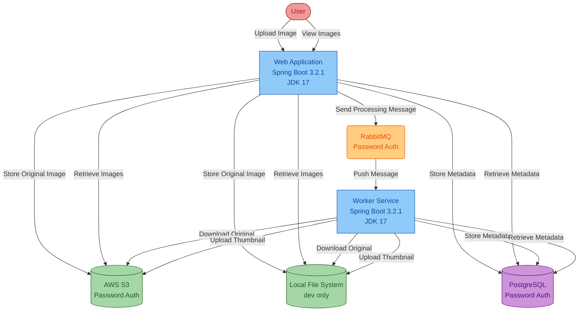
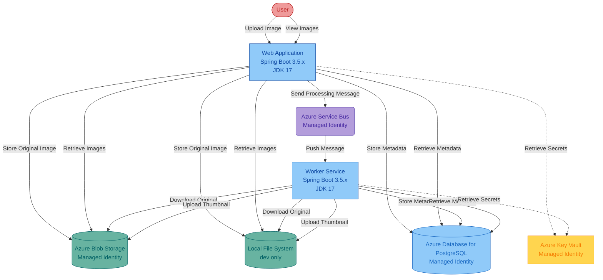

# Modernization Plan

**Branch**: `001-modernization-plan` | **Date**: 2025-12-31 | **Github Issue**: https://github.com/zhiyongli_microsoft/asset-manager/issues/17

---

## Modernization Goal

Migrate the Asset Manager project to Azure by replacing AWS services with Azure equivalents and implementing security best practices. The primary objective is to modernize the application to run on Azure using managed services with managed identity authentication for secure, credential-free access to Azure resources.

## Scope

This modernization plan covers the following code changes based on the AppCAT assessment report and user input:

1. **Java Upgrade**
   - JDK (11 → 17) [based on AppCAT report mandatory issue]
   - Spring Boot (3.2.1 → 3.5.x) [based on AppCAT report mandatory issue - End of OSS Support]

2. **Migration To Azure**
   - Migrate storage from AWS S3 to Azure Blob Storage [based on AppCAT report mandatory issue]
   - Migrate messaging from RabbitMQ to Azure Service Bus [based on AppCAT report optional issue]
   - Migrate to Azure Database for PostgreSQL with managed identity [based on AppCAT report potential issue]
   - Migrate plaintext credentials to Azure Key Vault [based on AppCAT report potential issue - password in config]
   - Migrate log output to console for cloud-native deployment [based on best practices]

3. **Containerization**
   - Generate Dockerfile and related files [based on AppCAT report mandatory issue - no Dockerfile found]

## References

- `https://github.com/zhiyongli_microsoft/asset-manager/issues/17` - Migration issue to be updated

## Application Information

### Current Architecture

**Current State:**
- **Framework**: Spring Boot 3.2.1, JDK 17
- **Build Tool**: Maven
- **Storage**: AWS S3 with access key/secret key authentication
- **Messaging**: RabbitMQ with username/password authentication (Spring AMQP)
- **Database**: PostgreSQL with username/password authentication
- **Authentication**: Password-based for all external services
- **Containerization**: No Dockerfile present

## Clarification

No open issues requiring clarification. The migration path is clear based on:
1. AppCAT report identifying all mandatory, potential, and optional issues
2. User's clear request to migrate to Azure
3. Available solution IDs in the knowledge base covering all required migrations
4. README.md documenting the target Azure architecture

## Target Architecture

**Target State:**
- **Framework**: Spring Boot 3.5.x (latest stable), JDK 17
- **Build Tool**: Maven
- **Storage**: Azure Blob Storage with managed identity authentication
- **Messaging**: Azure Service Bus with managed identity authentication (Spring Cloud Azure)
- **Database**: Azure Database for PostgreSQL with managed identity authentication
- **Authentication**: Managed identity for all Azure services (credential-free)
- **Secrets Management**: Azure Key Vault for sensitive configuration
- **Logging**: Console-based logging for Azure Monitor integration
- **Containerization**: Dockerfile for container deployment

## Task Breakdown

### 1. Java Upgrade

1) **Task name**: Upgrade Spring Boot to 3.5.x
   - **Task Type**: Java Upgrade
   - **Description**: Upgrade Spring Boot from 3.2.1 to 3.5.x (latest stable version). This upgrade ensures continued OSS support and includes improvements in security, performance, and compatibility. Spring Boot 3.x requires JDK 17 as minimum version.
   - **Solution Id**: spring-boot-upgrade

### 2. Migration To Azure

2) **Task name**: Migrate from AWS S3 to Azure Blob Storage
   - **Task Type**: Migration To Azure
   - **Description**: Replace AWS S3 storage with Azure Blob Storage. This migration will update all file storage operations to use Azure Blob Storage SDK, remove AWS SDK dependencies, and configure Azure Storage connection using managed identity for secure, credential-free authentication.
   - **Solution Id**: s3-to-azure-blob-storage

3) **Task name**: Migrate from RabbitMQ to Azure Service Bus
   - **Task Type**: Migration To Azure
   - **Description**: Replace RabbitMQ messaging with Azure Service Bus. This migration will update message queue operations to use Azure Service Bus, replace Spring AMQP with Spring Cloud Azure Service Bus integration, and configure Service Bus connection using managed identity.
   - **Solution Id**: amqp-rabbitmq-servicebus

4) **Task name**: Migrate to Azure Database for PostgreSQL with Managed Identity
   - **Task Type**: Migration To Azure
   - **Description**: Configure Azure Database for PostgreSQL connection using managed identity authentication. This migration will remove password-based database authentication, add Azure SDK for PostgreSQL, and implement secure, credential-free database access using DefaultAzureCredential.
   - **Solution Id**: mi-postgresql-azure-sdk-public-cloud

5) **Task name**: Migrate plaintext credentials to Azure Key Vault
   - **Task Type**: Migration To Azure
   - **Description**: Move sensitive configuration values (passwords, connection strings, access keys) from application.properties to Azure Key Vault. This migration will integrate Azure Key Vault with Spring Cloud Azure, retrieve secrets at runtime using managed identity, and remove plaintext credentials from configuration files.
   - **Solution Id**: plaintext-credential-to-azure-keyvault

6) **Task name**: Enable managed identity authentication for all Azure services
   - **Task Type**: Migration To Azure
   - **Description**: Ensure all Azure service connections (Blob Storage, Service Bus, PostgreSQL, Key Vault) use managed identity authentication (DefaultAzureCredential). This task consolidates authentication configuration and removes all password-based credentials from the application.
   - **Solution Id**: mi-postgresql-azure-sdk-public-cloud

7) **Task name**: Migrate log output to console
   - **Task Type**: Migration To Azure
   - **Description**: Configure logging to output to console instead of file-based logging. This enables integration with Azure Monitor, Application Insights, and container logging systems for cloud-native observability.
   - **Solution Id**: log-to-console

### 3. Containerization

8) **Task name**: Containerize Java Application
   - **Task Type**: Containerize
   - **Description**: Generate Dockerfile and related container configuration files for both web and worker modules. This includes creating multi-stage build Dockerfiles, optimizing image layers, configuring proper base images, and ensuring container readiness for Azure Container Apps or Azure Kubernetes Service deployment.
   - **Solution Id**: containerization-copilot-agent
