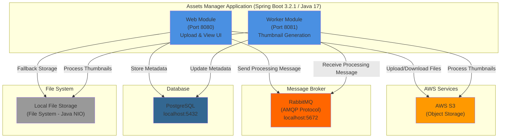

# Modernization Plan

**Branch**: `001-modernization-plan` | **Date**: 2025-12-31 | **Github Issue**: https://github.com/zhiyongli_microsoft/asset-manager/issues/17

---

## Modernization Goal

Migrate the Assets Manager application to Azure, transitioning from AWS services (S3, region configurations) and RabbitMQ to Azure-native services (Azure Blob Storage, Azure Service Bus), while also improving security by migrating plaintext credentials to Azure Key Vault and connecting to Azure Database for PostgreSQL using managed identity. The application will be containerized and prepared for deployment to Azure Container Apps.

## Scope

This modernization plan covers the following scope based on the project information, appcat report, and user request:

1. **Migration To Azure**
   - Migrate storage from AWS S3 to Azure Blob Storage [based on appcat report: ruleid=azure-aws-config-s3-03000, ruleid=azure-aws-config-s3-03001]
   - Migrate messaging from RabbitMQ (AMQP) to Azure Service Bus [based on appcat report: ruleid=azure-message-queue-rabbitmq-01000, ruleid=azure-message-queue-config-rabbitmq-01000, ruleid=azure-message-queue-amqp-02000]
   - Migrate plaintext credentials to Azure Key Vault [based on appcat report: ruleid=azure-password-01000]
   - Migrate PostgreSQL connection to use Azure Database for PostgreSQL with Azure SDK and Managed Identity [based on appcat report: ruleid=azure-database-postgresql-02000, ruleid=localhost-jdbc-00002]
   - Migrate file system operations to Azure Storage Account File Share mounts [based on appcat report: ruleid=local-storage-00005]
   - Migrate logging to console for cloud-native compatibility [for Azure Monitor integration]

2. **Containerize the application**
   - Generate Dockerfile and related files for both web and worker modules [based on appcat report: ruleid=dockerfile-00000]

## References

- `https://github.com/zhiyongli_microsoft/asset-manager/issues/17` - Migration issue to be updated with progress

## Application Information

### Current Architecture

**Current Framework Stack:**
- **Framework**: Spring Boot 3.2.1, Spring Framework (included in Spring Boot)
- **Java Version**: 17
- **Build Tool**: Maven
- **Key Dependencies**:
  - Spring Boot Starter Web
  - Spring Boot Starter AMQP (RabbitMQ)
  - Spring Boot Starter Data JPA
  - AWS SDK for Java v2 (S3)
  - PostgreSQL JDBC Driver
  - Thymeleaf (Web UI)

**Resource Dependencies:**
- AWS S3 with hardcoded credentials (accessKey, secretKey)
- RabbitMQ with plaintext credentials (guest/guest)
- PostgreSQL with plaintext credentials (postgres/postgres)
- Local file system for backup storage

## Clarification

No open issues at this time. The migration path is clear based on the appcat report and available Azure solutions.

## Target Architecture

```mermaid
graph TB
    subgraph "Assets Manager Application (Spring Boot 3.2.1 / Java 17)"
        Web["Web Module<br/>(Containerized)<br/>Upload & View UI"]
        Worker["Worker Module<br/>(Containerized)<br/>Thumbnail Generation"]
    end
    
    subgraph "Azure Storage Services"
        BlobStorage["Azure Blob Storage<br/>(Object Storage)<br/>with Managed Identity"]
        FileShare["Azure File Share<br/>(File System Mount)<br/>with Managed Identity"]
    end
    
    subgraph "Azure Messaging"
        ServiceBus["Azure Service Bus<br/>(Premium Tier)<br/>with Managed Identity"]
    end
    
    subgraph "Azure Database"
        AzurePostgreSQL["Azure Database for PostgreSQL<br/>with Managed Identity"]
    end
    
    subgraph "Azure Security"
        KeyVault["Azure Key Vault<br/>(Secrets Management)<br/>with Managed Identity"]
    end
    
    subgraph "Azure Monitoring"
        AppInsights["Azure Application Insights<br/>(Logging & Monitoring)"]
    end
    
    Web -->|Upload/Download with MI| BlobStorage
    Web -->|File Operations with MI| FileShare
    Web -->|Send Messages with MI| ServiceBus
    Web -->|Store Metadata with MI| AzurePostgreSQL
    Web -->|Retrieve Secrets with MI| KeyVault
    Web -->|Console Logs| AppInsights
    
    Worker -->|Receive Messages with MI| ServiceBus
    Worker -->|Process Thumbnails with MI| BlobStorage
    Worker -->|File Operations with MI| FileShare
    Worker -->|Update Metadata with MI| AzurePostgreSQL
    Worker -->|Retrieve Secrets with MI| KeyVault
    Worker -->|Console Logs| AppInsights
    
    style Web fill:#0078D4
    style Worker fill:#0078D4
    style BlobStorage fill:#0089D6
    style FileShare fill:#0089D6
    style ServiceBus fill:#0089D6
    style AzurePostgreSQL fill:#0089D6
    style KeyVault fill:#00BCF2
    style AppInsights fill:#00BCF2
```

**Target Framework Stack:**
- **Framework**: Spring Boot 3.2.1 (current version is sufficient)
- **Java Version**: 17 (current version is sufficient)
- **Build Tool**: Maven
- **Key Dependencies** (to be updated):
  - Azure SDK for Blob Storage
  - Azure SDK for Service Bus
  - Azure SDK for PostgreSQL
  - Azure SDK for Key Vault
  - Azure Identity for Managed Identity support
  - Remove AWS SDK dependencies
  - Remove RabbitMQ dependencies

**Resource Dependencies:**
- Azure Blob Storage with Managed Identity authentication
- Azure Service Bus with Managed Identity authentication
- Azure Database for PostgreSQL with Managed Identity authentication
- Azure Key Vault with Managed Identity for secrets management
- Azure File Share mounted for file system operations
- Azure Application Insights for logging and monitoring

## Task Breakdown

1. **Task name**: Migrate from AWS S3 to Azure Blob Storage
   - **Task Type**: Migration To Azure
   - **Description**: Replace AWS S3 SDK with Azure Blob Storage SDK. Update AwsS3Service to use Azure Blob Storage client. Migrate S3 bucket references to Azure Blob containers. Update all file upload, download, list, and delete operations to use Azure Blob Storage APIs. Remove AWS SDK dependencies and AWS region configurations.
   - **Solution Id**: s3-to-azure-blob-storage

2. **Task name**: Migrate from RabbitMQ (AMQP) to Azure Service Bus
   - **Task Type**: Migration To Azure
   - **Description**: Replace Spring AMQP/RabbitMQ dependencies with Azure Service Bus SDK. Update RabbitConfig to use Azure Service Bus configuration. Migrate message producers and consumers to use Azure Service Bus APIs. Remove RabbitMQ configuration properties (host, port, username, password).
   - **Solution Id**: amqp-rabbitmq-servicebus

3. **Task name**: Migrate file system operations to Azure Storage Account File Share mounts
   - **Task Type**: Migration To Azure
   - **Description**: Replace local file system operations (Java NIO) with Azure Storage Account File Share mounts. Update LocalFileStorageService to use mounted Azure File Share paths. Ensure proper path handling for cloud-based file storage.
   - **Solution Id**: local-files-to-mounted-azure-storage

4. **Task name**: Migrate from Plaintext Credentials to Azure Key Vault
   - **Task Type**: Migration To Azure
   - **Description**: Move all plaintext credentials (AWS keys, RabbitMQ credentials, database passwords) from application.properties to Azure Key Vault. Update configuration to retrieve secrets from Azure Key Vault at runtime. Remove hardcoded credentials from configuration files.
   - **Solution Id**: plaintext-credential-to-azure-keyvault

5. **Task name**: Migrate to Azure Database for PostgreSQL with Managed Identity
   - **Task Type**: Migration To Azure
   - **Description**: Update PostgreSQL connection configuration to use Azure Database for PostgreSQL with Azure SDK and Managed Identity. Remove JDBC connection string with hardcoded credentials. Configure passwordless authentication using Microsoft Entra ID (formerly Azure AD).
   - **Solution Id**: mi-postgresql-azure-sdk-public-cloud

6. **Task name**: Migrate logging to console output
   - **Task Type**: Migration To Azure
   - **Description**: Update logging configuration to output to console instead of files for cloud-native deployment and Azure Monitor integration. Ensure all application logs are written to stdout/stderr for proper collection by Azure Application Insights.
   - **Solution Id**: log-to-console

7. **Task name**: Generate Dockerfiles and containerization files
   - **Task Type**: Containerize
   - **Description**: Create Dockerfiles for both web and worker modules to containerize the application for deployment to Azure Container Apps. Include multi-stage build for optimized image size. Configure proper health checks, environment variables, and Azure-specific configurations. Generate docker-compose.yml for local testing.
   - **Solution Id**: containerization-copilot-agent
