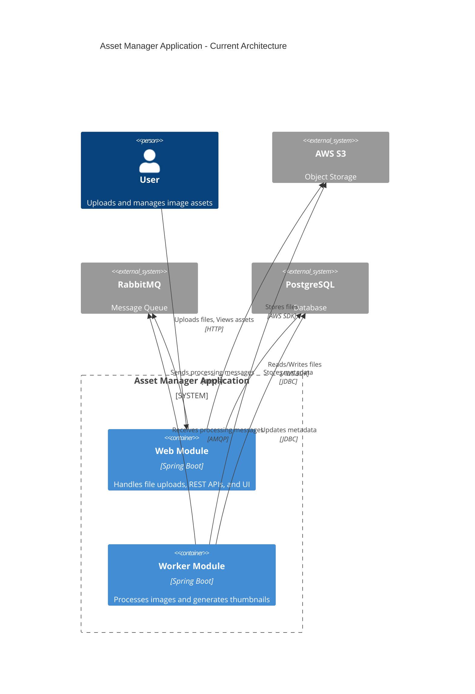
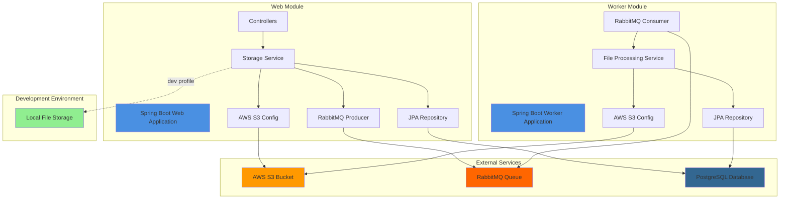
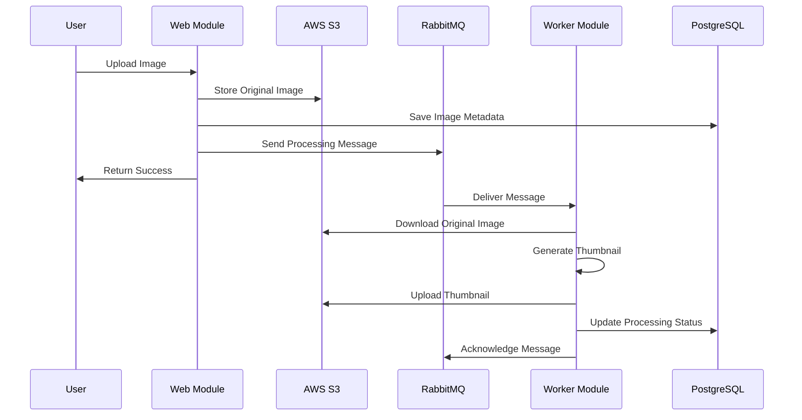

# Asset Manager Application - Architecture Diagram

## Current Architecture Overview

This document provides a visual representation of the Asset Manager application architecture based on the assessment analysis.

## Application Information

- **Name**: Asset Manager
- **Type**: Multi-module Spring Boot Application
- **Version**: 0.0.1-SNAPSHOT
- **Framework**: Spring Boot 3.2.1
- **Language**: Java 17
- **Build Tool**: Maven

## High-Level Architecture Diagram

## Component Architecture Diagram

## Data Flow Diagram

## Technology Stack

### Core Framework
- **Spring Boot**: 3.2.1
- **Java**: 17
- **Maven**: Multi-module project

### Web Module Dependencies
- `spring-boot-starter-web` - REST APIs and MVC
- `spring-boot-starter-thymeleaf` - UI templating
- `spring-boot-starter-data-jpa` - Data persistence
- `spring-boot-starter-amqp` - RabbitMQ messaging
- `software.amazon.awssdk:s3` - AWS S3 integration (v2.25.13)
- `postgresql` - PostgreSQL driver
- `lombok` - Code generation

### Worker Module Dependencies
- `spring-boot-starter` - Core Spring Boot
- `spring-boot-starter-data-jpa` - Data persistence
- `spring-boot-starter-amqp` - RabbitMQ messaging
- `software.amazon.awssdk:s3` - AWS S3 integration (v2.25.13)
- `jackson-databind` - JSON processing
- `postgresql` - PostgreSQL driver
- `lombok` - Code generation

## External Service Dependencies

### 1. AWS S3 (Object Storage)
- **Purpose**: Store original images and thumbnails
- **SDK**: AWS SDK for Java v2.25.13
- **Configuration**: Access key, secret key, region, bucket name
- **Profile**: Active when NOT in 'dev' profile

### 2. RabbitMQ (Message Queue)
- **Purpose**: Asynchronous communication between web and worker modules
- **Queue**: `image-processing`
- **Message Format**: JSON (ImageProcessingMessage)
- **Acknowledgment**: Manual acknowledgment mode
- **Configuration**: Host, port, username, password

### 3. PostgreSQL (Database)
- **Purpose**: Store image metadata and processing status
- **Tables**: ImageMetadata (via JPA)
- **Configuration**: JDBC URL, username, password
- **Schema Management**: Hibernate DDL auto-update

### 4. Local File Storage (Development Only)
- **Purpose**: Development environment without AWS dependencies
- **Profile**: Active in 'dev' profile
- **Implementation**: LocalFileStorageService

## Key Architectural Patterns

### 1. Multi-Module Structure
- **Web Module**: User-facing application (port 8080)
- **Worker Module**: Background processing (port 8081)
- Separation of concerns for scalability

### 2. Profile-Based Configuration
- **Dev Profile**: Uses local file storage, H2 test database
- **Production Profile**: Uses AWS S3, RabbitMQ, PostgreSQL
- Enables local development without cloud resources

### 3. Asynchronous Processing
- Upload returns immediately to user
- Processing happens in background via message queue
- Decouples web tier from processing tier

### 4. Storage Abstraction
- `StorageService` interface
- Multiple implementations: `AwsS3Service`, `LocalFileStorageService`
- Profile-based activation

## Configuration Files

### Web Module
- `application.properties`: AWS S3, RabbitMQ, PostgreSQL configs
- Hardcoded credentials (security concern)

### Worker Module
- `application.properties`: AWS S3, RabbitMQ, PostgreSQL configs
- Different server port (8081)

## Security Concerns

⚠️ **Critical Issues Identified**:
1. Hardcoded AWS credentials in properties files
2. Hardcoded RabbitMQ credentials
3. Hardcoded database credentials
4. No encryption or secrets management

## Cloud Readiness Assessment

### Current State
- **Cloud Provider**: AWS-specific (S3)
- **Messaging**: RabbitMQ (requires infrastructure management)
- **Database**: Self-hosted PostgreSQL
- **Authentication**: Access key-based (insecure)

### Migration Complexity: Medium-High
- 34 incidents identified
- 18 story points estimated effort
- Major changes required:
  - AWS S3 → Azure Blob Storage
  - RabbitMQ → Azure Service Bus
  - Credential management → Managed Identity

## Next Steps

1. **Review Assessment Report**: Check `.github/modernize/report.json` for detailed findings
2. **Plan Migration**: Prioritize critical issues (S3, RabbitMQ, credentials)
3. **Implement Changes**: Follow migration recommendations
4. **Test Thoroughly**: Validate each component after migration
5. **Deploy to Azure**: Use Azure App Service or Container Apps

---

**Generated**: 2026-02-11T05:35:17.769Z  
**Assessment Tool**: AppCAT Manual Assessment 1.0.0  
**Cloud Target**: Microsoft Azure
