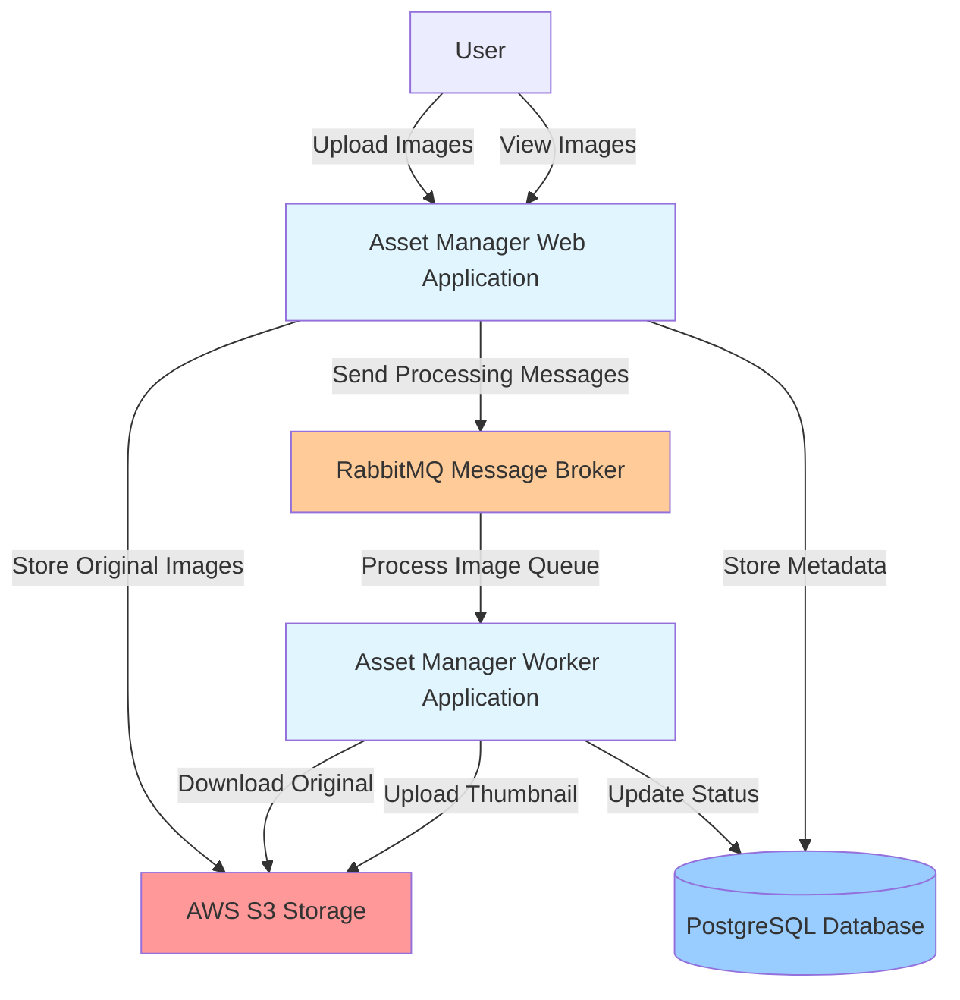
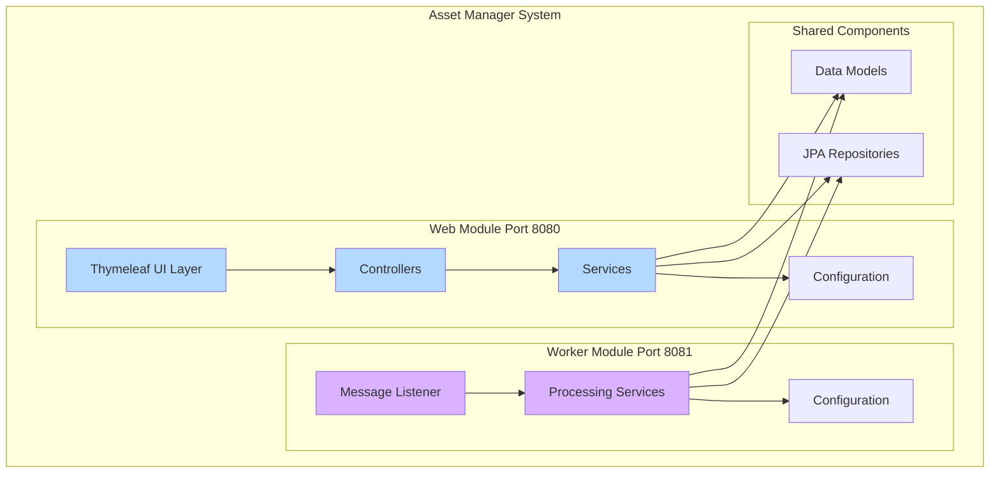
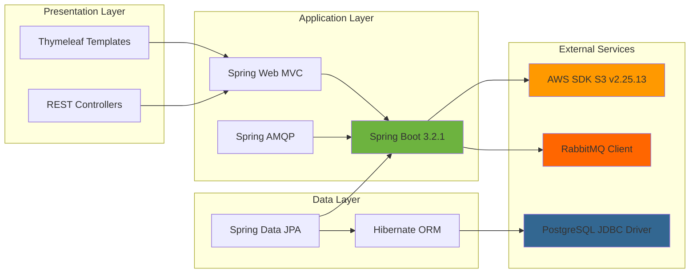
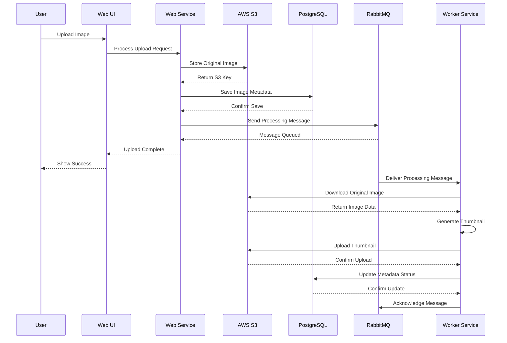
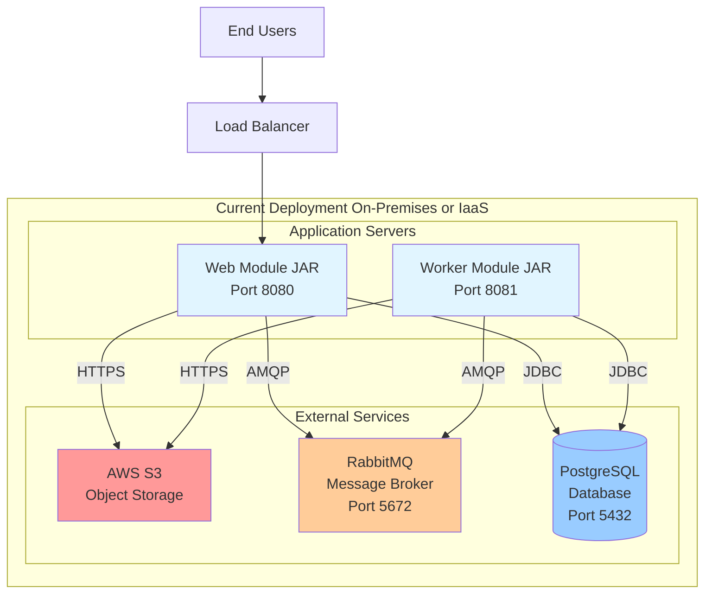
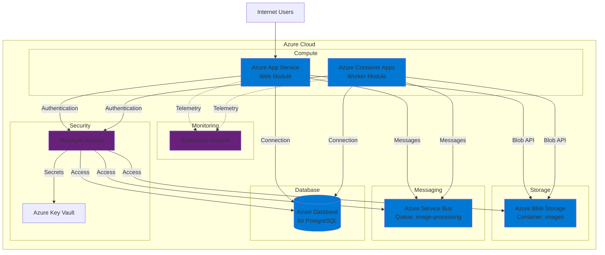
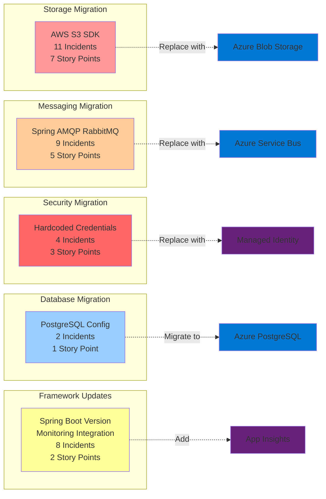

# Asset Manager Application - Architecture Diagram

## Overview

This document provides visual representations of the Asset Manager application architecture based on the assessment results. The application is a multi-module Spring Boot system for managing image assets with asynchronous thumbnail generation.

## Application Profile

- **Name**: Asset Manager Application
- **Type**: Java Spring Boot Multi-Module
- **Version**: 0.0.1-SNAPSHOT
- **Framework**: Spring Boot 3.2.1
- **Java Version**: 17
- **Build Tool**: Maven

---

## C4 Model - System Context Diagram

This diagram shows the Asset Manager system and its interactions with external systems and users.

---

## Application Architecture - Module Structure

This diagram illustrates the multi-module structure and key components within each module.

---

## Technology Stack

---

## Data Flow - Image Upload and Processing

This diagram shows the complete flow of an image from upload to thumbnail generation.

---

## Component Details

### Web Module Components

| Component | Type | Responsibility |
|-----------|------|----------------|
| **HomeController** | Controller | Handles home page requests and navigation |
| **S3Controller** | Controller | Manages file upload and storage operations |
| **AwsS3Service** | Service | Implements S3 file operations (upload, download, delete) |
| **LocalFileStorageService** | Service | Provides local file storage for dev/test |
| **BackupMessageProcessor** | Service | Handles message publishing to RabbitMQ |
| **ImageMetadataRepository** | Repository | JPA repository for image metadata CRUD |
| **AwsS3Config** | Configuration | Configures AWS S3 client with credentials |
| **RabbitConfig** | Configuration | Configures RabbitMQ queues and connection |

### Worker Module Components

| Component | Type | Responsibility |
|-----------|------|----------------|
| **Message Listener** | Listener | Consumes messages from RabbitMQ queue |
| **S3FileProcessingService** | Service | Processes images from S3 storage |
| **LocalFileProcessingService** | Service | Processes local files for dev/test |
| **AbstractFileProcessingService** | Service | Base class for file processing logic |
| **FileProcessor** | Service | Core thumbnail generation logic |
| **AwsS3Config** | Configuration | Worker module S3 client configuration |
| **RabbitConfig** | Configuration | Worker module RabbitMQ configuration |

---

## Deployment Architecture

---

## Target Azure Architecture (Post-Migration)

---

## Migration Impact Areas

### High Priority Migration Areas

---

## Key Findings Summary

### Application Characteristics

- **Architecture Pattern**: Multi-module microservices with async processing
- **Communication**: REST (user-facing) + Message Queue (inter-module)
- **Storage Pattern**: Object storage for files, relational DB for metadata
- **Deployment**: Two independent deployable modules

### Migration Complexity

- **Cloud Readiness Score**: 62/100 (Moderate)
- **Total Incidents**: 34
- **Estimated Effort**: 18 Story Points (3-4 weeks)
- **Critical Issues**: 7 (AWS S3, RabbitMQ, Credentials)
- **High Priority Issues**: 15 (Service implementations, configurations)

### Technology Dependencies

| Category | Current Technology | Target Azure Service | Migration Effort |
|----------|-------------------|---------------------|------------------|
| **Storage** | AWS S3 | Azure Blob Storage | High (7 points) |
| **Messaging** | RabbitMQ | Azure Service Bus | High (5 points) |
| **Database** | PostgreSQL | Azure Database for PostgreSQL | Low (1 point) |
| **Authentication** | Static Credentials | Managed Identity | Medium (3 points) |
| **Monitoring** | None | Application Insights | Medium (2 points) |

---

## Notes

- This architecture diagram was generated based on code analysis and assessment results
- The application follows good separation of concerns with distinct web and worker modules
- LocalFileStorageService exists for development/testing and should be preserved
- The async processing pattern with message queues is well-suited for cloud deployment
- Both modules share common data models and repository interfaces for consistency

---

## Next Steps

1. Review this architecture with stakeholders
2. Validate migration priorities based on business requirements
3. Create detailed migration plan for each phase
4. Set up Azure resources and test environments
5. Begin with Phase 1: Managed Identity and Service Bus migration
6. Continue with Phase 2: Blob Storage migration
7. Complete with Phase 3: Database configuration and monitoring

---

**Generated**: 2026-02-11T06:07:42.203Z  
**Tool**: Manual Architecture Analysis  
**Version**: 1.0.0
