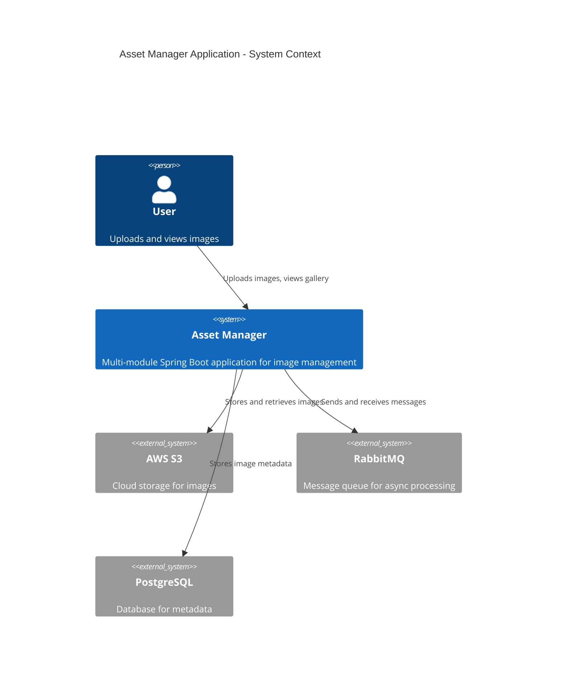
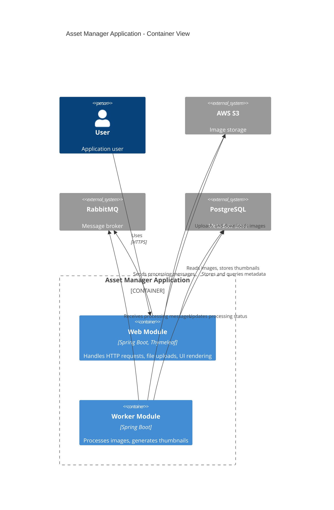
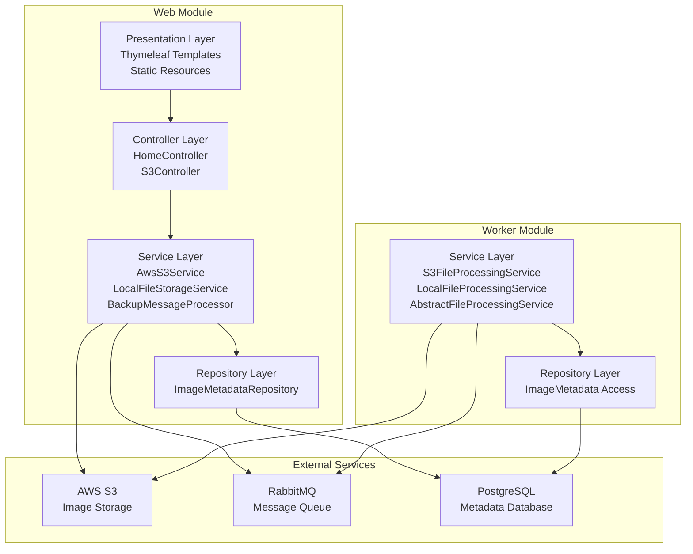
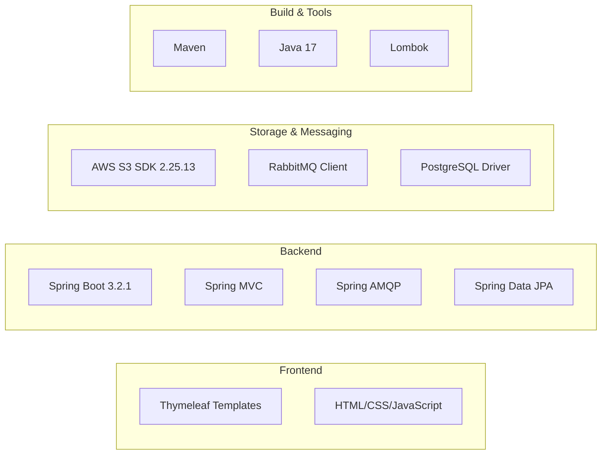
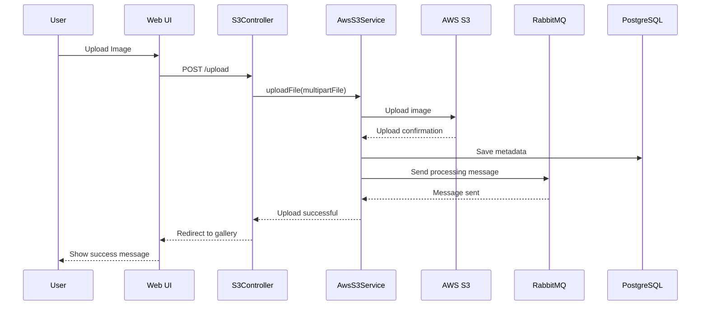
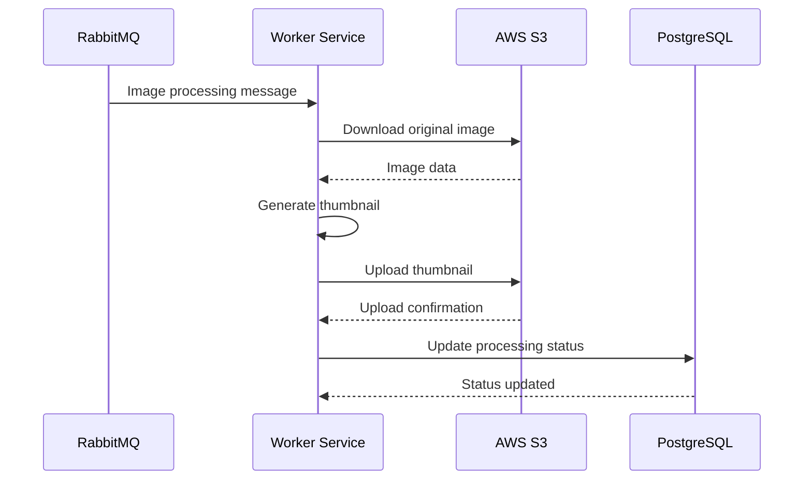
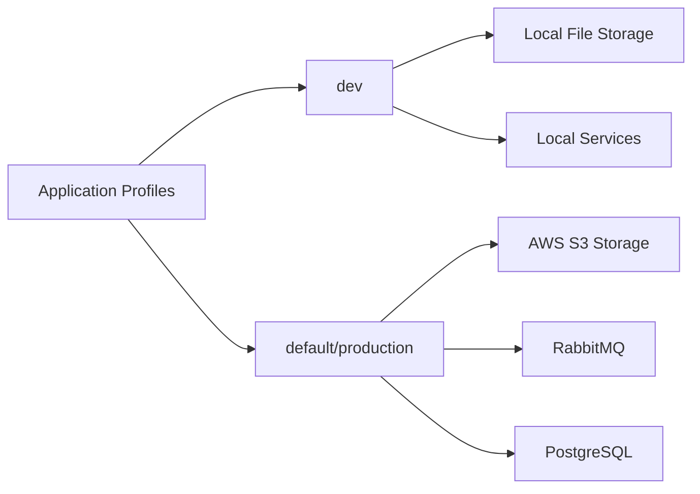
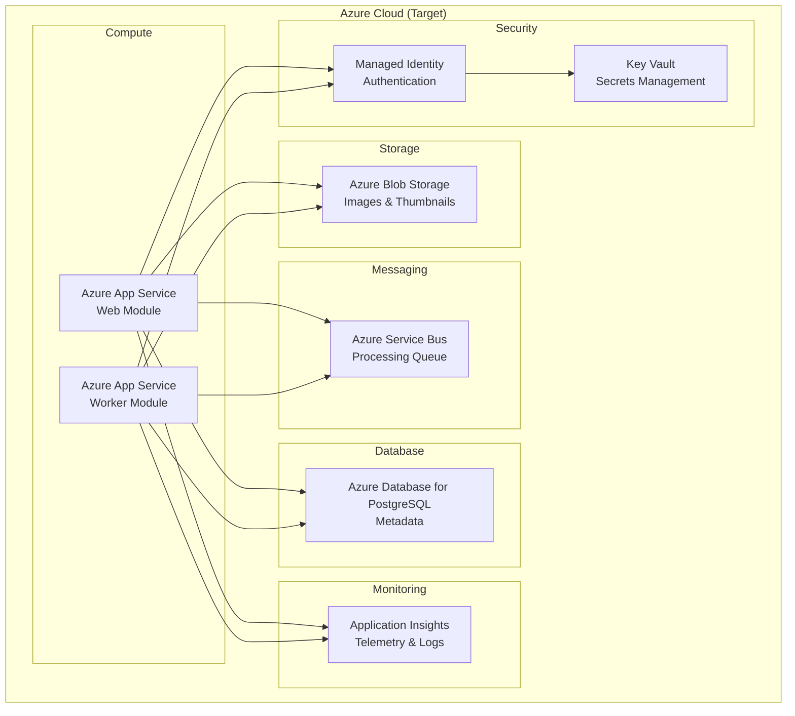

# Application Architecture Diagram

## Overview

This document contains the architecture diagram for the **Asset Manager** application, generated from the application assessment.

## Application Type

- **Framework**: Spring Boot 3.2.1
- **Language**: Java 17
- **Architecture**: Multi-module Maven project
- **Modules**: Web (UI & API) + Worker (Background Processing)

## C4 Context Diagram

## C4 Container Diagram

## Application Architecture Layers

## Technology Stack

## Data Flow

### Upload Flow

### Processing Flow

## Configuration Profiles

The application supports multiple configuration profiles:

- **dev profile**: Uses local file storage, no cloud dependencies
- **default profile**: Uses AWS S3, RabbitMQ, and PostgreSQL

## Key Components

### Web Module Components

| Component | Purpose | Technology |
|-----------|---------|------------|
| HomeController | Handles main UI requests | Spring MVC |
| S3Controller | Manages file operations | Spring MVC |
| AwsS3Service | AWS S3 integration | AWS SDK |
| LocalFileStorageService | Local file storage (dev) | Java NIO |
| BackupMessageProcessor | Message backup handling | Spring AMQP |
| ImageMetadataRepository | Database access | Spring Data JPA |

### Worker Module Components

| Component | Purpose | Technology |
|-----------|---------|------------|
| S3FileProcessingService | S3 file processing | AWS SDK |
| LocalFileProcessingService | Local file processing (dev) | Java NIO |
| AbstractFileProcessingService | Base processing logic | Spring Boot |

## External Dependencies

### Cloud Storage
- **AWS S3** (software.amazon.awssdk:s3:2.25.13)
  - Image storage
  - Thumbnail storage
  - File retrieval

### Messaging
- **RabbitMQ** (spring-boot-starter-amqp)
  - Async image processing queue
  - Message-based communication between web and worker

### Database
- **PostgreSQL** (org.postgresql:postgresql)
  - Image metadata storage
  - Processing status tracking
  - JPA/Hibernate ORM

## Security Considerations

⚠️ **Current Security Issues** (from Assessment):

1. **Hardcoded AWS Credentials**: Access keys in application.properties
2. **Hardcoded Database Credentials**: Username/password in configuration
3. **Hardcoded RabbitMQ Credentials**: Default guest credentials

🎯 **Recommended Security Improvements**:
- Implement Azure Managed Identity
- Use Azure Key Vault for secrets
- Remove all hardcoded credentials

## Migration Notes

This architecture assessment identifies the following components requiring migration to Azure:

| Current | Azure Target | Effort |
|---------|--------------|--------|
| AWS S3 | Azure Blob Storage | High (7 points) |
| RabbitMQ | Azure Service Bus | Medium (5 points) |
| PostgreSQL | Azure Database for PostgreSQL | Low (1 point) |
| Hardcoded Credentials | Azure Managed Identity + Key Vault | Medium (3 points) |
| No Monitoring | Azure Application Insights | Low (1 point) |

**Total Estimated Effort**: 18 story points

## Architecture Strengths

✅ **Good Practices**:
- Clear separation of concerns (web vs. worker)
- Profile-based configuration for different environments
- Async processing pattern for long-running tasks
- Repository pattern for data access
- Multi-module Maven structure

⚠️ **Areas for Improvement**:
- Remove cloud provider-specific naming (S3Controller, S3StorageItem)
- Implement proper secrets management
- Add monitoring and observability
- Upgrade to latest Spring Boot LTS version
- Add comprehensive error handling

## Deployment Architecture

## Summary

The Asset Manager is a well-structured Spring Boot application with clear separation between web and worker modules. The architecture follows good practices with async processing and profile-based configuration. The main migration work involves replacing AWS services with Azure equivalents and implementing proper security through Managed Identity and Key Vault.

**Cloud Readiness Score**: 62/100

**Primary Migration Tasks**:
1. Migrate AWS S3 to Azure Blob Storage
2. Migrate RabbitMQ to Azure Service Bus  
3. Implement Azure Managed Identity for authentication
4. Configure Azure Database for PostgreSQL
5. Add Azure Application Insights for monitoring
6. Remove all hardcoded credentials
