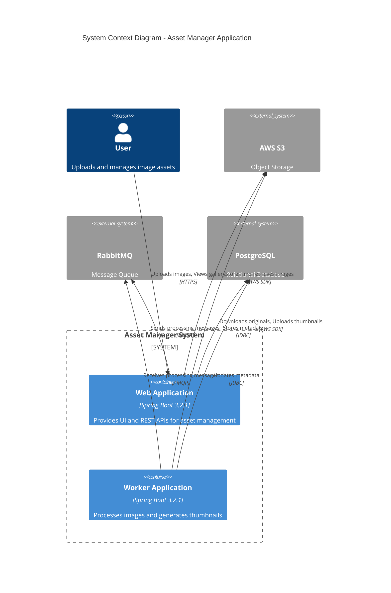
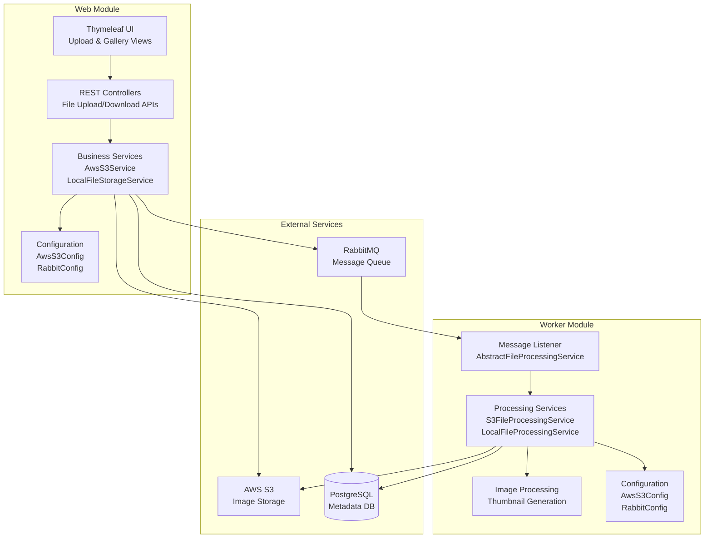
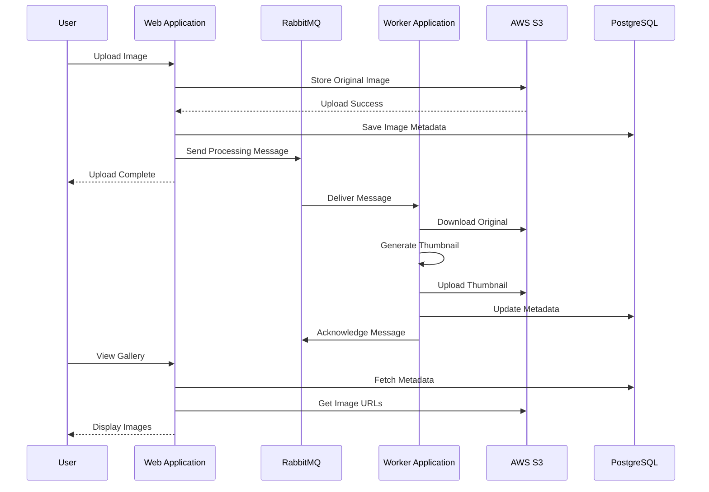
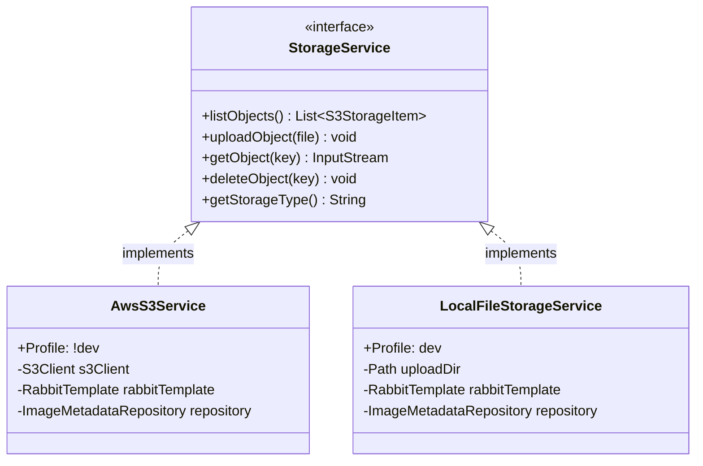
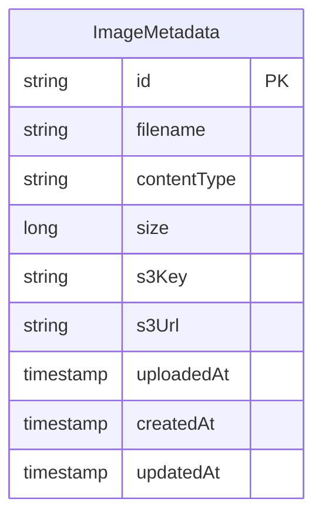
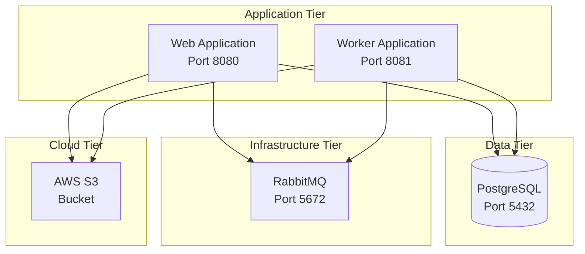

# Architecture Diagram - Asset Manager Application

## Overview

This document provides a visual representation of the Asset Manager application architecture based on the assessment analysis.

## Application Information

- **Name**: Asset Manager
- **Type**: Multi-module Spring Boot Application
- **Framework**: Spring Boot 3.2.1
- **Language**: Java 17
- **Build Tool**: Maven
- **Modules**: Web (UI & API), Worker (Background Processing)

## High-Level Architecture



## Component Architecture



## Data Flow



## Technology Stack

### Web Module
- **Framework**: Spring Boot 3.2.1
- **View Layer**: Thymeleaf
- **REST Layer**: Spring Web MVC
- **Data Access**: Spring Data JPA with Hibernate
- **Messaging**: Spring AMQP (RabbitMQ)
- **Cloud Storage**: AWS SDK for Java 2.25.13
- **Database Driver**: PostgreSQL JDBC

### Worker Module
- **Framework**: Spring Boot 3.2.1
- **Data Access**: Spring Data JPA with Hibernate
- **Messaging**: Spring AMQP (RabbitMQ)
- **Cloud Storage**: AWS SDK for Java 2.25.13
- **Image Processing**: Java ImageIO
- **Database Driver**: PostgreSQL JDBC

### Infrastructure
- **Object Storage**: AWS S3
- **Message Queue**: RabbitMQ
- **Database**: PostgreSQL
- **Build Tool**: Maven

## Key Dependencies

| Dependency | Version | Purpose | Used In |
|------------|---------|---------|---------|
| Spring Boot | 3.2.1 | Application Framework | Web, Worker |
| AWS SDK S3 | 2.25.13 | Cloud Storage | Web, Worker |
| Spring AMQP | (Spring Boot) | Message Queue Integration | Web, Worker |
| PostgreSQL | (Runtime) | Database Driver | Web, Worker |
| Thymeleaf | (Spring Boot) | Template Engine | Web |
| Spring Data JPA | (Spring Boot) | Data Access | Web, Worker |
| Lombok | (Optional) | Code Generation | Web, Worker |

## Configuration Profiles

The application supports multiple configuration profiles:

- **dev profile**: Uses local file storage instead of AWS S3
- **default profile**: Uses AWS S3 for cloud storage

Profile-specific services:
- `LocalFileStorageService` - Active with `dev` profile
- `AwsS3Service` - Active without `dev` profile (default)

## Storage Layer Design



## Message Processing Architecture

```mermaid
graph LR
    WebApp[Web Application]
    Queue[RabbitMQ Queue<br/>image-processing]
    Worker[Worker Application]
    
    WebApp -->|RabbitTemplate<br/>convertAndSend| Queue
    Queue -->|@RabbitListener<br/>Manual ACK| Worker
    
    style Queue fill:#ff9,stroke:#333,stroke-width:2px
```

### Message Structure

```json
{
  "key": "uuid-filename.jpg",
  "contentType": "image/jpeg",
  "storageType": "s3",
  "size": 1048576
}
```

## Database Schema



## Deployment Architecture (Current State)



## Security Configuration

### Authentication
- **AWS S3**: Access Key & Secret Key (configured in application.properties)
- **RabbitMQ**: Username & Password (guest/guest for local dev)
- **PostgreSQL**: Username & Password (postgres/postgres for local dev)

⚠️ **Security Concerns**:
- Credentials stored in plain text in application.properties
- No secrets management solution
- No managed identity or IAM roles

## Migration Considerations

### AWS-Specific Components to Migrate

1. **AWS S3 SDK** (software.amazon.awssdk:s3)
   - Used in: AwsS3Service, S3FileProcessingService
   - Target: Azure Blob Storage SDK

2. **RabbitMQ** (Spring AMQP)
   - Used in: RabbitConfig, Message processing
   - Target: Azure Service Bus

3. **Credentials Management**
   - Current: Plain text in application.properties
   - Target: Azure Managed Identity / Key Vault

### Architecture Strengths for Migration

✅ **Profile-based Configuration**: Easy to add Azure profiles alongside existing ones
✅ **StorageService Interface**: Clean abstraction for adding Azure Blob Storage implementation
✅ **Module Separation**: Web and Worker can be migrated independently
✅ **Spring Boot Framework**: Good support for Azure services via Spring Cloud Azure

## Architecture Patterns Used

- **Multi-module Maven Project**: Separation of concerns between web and worker
- **Interface-based Design**: StorageService abstraction for storage implementations
- **Profile-based Configuration**: Environment-specific implementations
- **Message-driven Architecture**: Async processing via message queue
- **Repository Pattern**: Data access through Spring Data JPA repositories
- **Dependency Injection**: Spring IoC container manages all components

## Key Observations

1. **Cloud-Ready Architecture**: Application already uses cloud storage and messaging, making Azure migration straightforward
2. **Good Abstraction**: StorageService interface allows adding Azure implementation without changing consumers
3. **Async Processing**: Message queue pattern is well-implemented and can be migrated to Azure Service Bus
4. **Profile Support**: Profile-based configuration makes it easy to support multiple environments
5. **Security Gaps**: Hardcoded credentials need to be addressed with Azure Key Vault or Managed Identity

## Next Steps

Based on this architecture analysis:

1. ✅ Create Azure Blob Storage implementation of StorageService interface
2. ✅ Migrate RabbitMQ configuration to Azure Service Bus
3. ✅ Implement Azure Managed Identity for authentication
4. ✅ Configure Azure Key Vault for secrets management
5. ✅ Add Application Insights for monitoring
6. ✅ Migrate PostgreSQL to Azure Database for PostgreSQL

---

*This diagram was generated based on automated assessment of the codebase structure, dependencies, and configuration files.*
