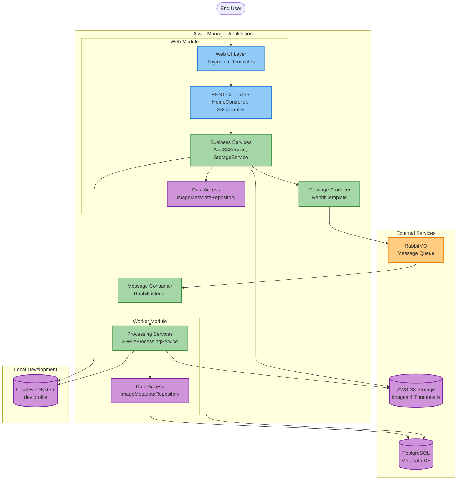

# Architecture Diagram

## Current Application Architecture

This diagram shows the high-level architecture of the asset-manager application based on code analysis.

## Architecture Summary

### Application Layers

**Presentation Layer**
- **Web UI**: Thymeleaf-based templates for user interaction
- **REST Controllers**: Handle HTTP requests and responses
  - `HomeController`: Manages home page and image viewing
  - `S3Controller`: Handles file uploads and downloads

**Business Logic Layer**
- **Storage Services**: Abstract storage operations
  - `AwsS3Service`: AWS S3 integration for cloud storage
  - `LocalFileStorageService`: Local filesystem for development
  - `StorageService`: Interface for storage abstraction
- **Processing Services**: Asynchronous image processing
  - `S3FileProcessingService`: Handles thumbnail generation
  - `FileProcessor`: Processing logic abstraction
- **Messaging**: Asynchronous communication
  - `MessageProducer`: Sends processing messages to queue
  - `MessageConsumer`: Receives and processes messages

**Data Access Layer**
- **Repositories**: JPA-based data access
  - `ImageMetadataRepository`: Manages image metadata persistence
- **Domain Models**:
  - `ImageMetadata`: Image metadata entity
  - `ImageProcessingMessage`: Queue message payload
  - `S3StorageItem`: Storage item representation

### Technology Stack

| Layer | Technology | Version |
|-------|-----------|---------|
| Framework | Spring Boot | 3.2.1 |
| Language | Java | 17 |
| Build Tool | Maven | Wrapper |
| Web | Spring Web + Thymeleaf | Managed |
| Data Access | Spring Data JPA | Managed |
| Database Driver | PostgreSQL JDBC | Managed |
| Messaging | Spring AMQP | Managed |
| Cloud Storage | AWS SDK for S3 | 2.25.13 |
| Development | Spring DevTools | Managed |
| Code Generation | Lombok | Managed |

### Data Storage

**Primary Storage**
- **AWS S3**: Object storage for images and thumbnails (production)
- **Local File System**: File storage for development environment

**Database**
- **PostgreSQL**: Relational database for image metadata
  - Image IDs, names, paths, sizes
  - Thumbnail references
  - Timestamps and status

**Message Queue**
- **RabbitMQ**: Message broker for asynchronous processing
  - Queues: image processing requests
  - Exchange: topic-based routing
  - Dead letter queue: failed message handling

### External Integrations

**AWS Services**
- **AWS S3**: Object storage service
  - Authentication: Access Key/Secret Key
  - SDK Version: 2.25.13
  - Operations: Upload, download, list, delete

**Message Broker**
- **RabbitMQ**: Message queuing service
  - Protocol: AMQP
  - Authentication: Username/Password
  - Features: Acknowledgments, retries, dead letter queues

**Database**
- **PostgreSQL**: Relational database
  - Connection: JDBC
  - Authentication: Username/Password
  - ORM: Hibernate via Spring Data JPA

### Data Flow

**Upload Flow**
1. User uploads image via Web UI
2. Controller receives multipart file
3. Service stores original image to S3/Local FS
4. Metadata saved to PostgreSQL
5. Processing message sent to RabbitMQ
6. Response returned to user

**Processing Flow**
1. Worker receives message from RabbitMQ
2. Downloads original image from S3/Local FS
3. Generates thumbnail
4. Uploads thumbnail to S3/Local FS
5. Updates metadata in PostgreSQL
6. Acknowledges message completion

**View Flow**
1. User requests image list
2. Controller queries PostgreSQL for metadata
3. Service generates S3/Local FS URLs
4. UI displays images with thumbnails
5. User clicks image to view full size

### Deployment Profiles

**Development Profile** (`dev`)
- Local file system for storage
- Local RabbitMQ instance
- Local PostgreSQL database

**AWS Profile** (`aws`)
- AWS S3 for storage
- AWS RabbitMQ (Amazon MQ)
- AWS RDS PostgreSQL

**Future Azure Profile** (`azure`)
- Azure Blob Storage (migration target)
- Azure Service Bus (migration target)
- Azure Database for PostgreSQL (migration target)

## Key Observations

### Strengths
- Clean separation of concerns with multi-module architecture
- Profile-based configuration for different environments
- Asynchronous processing for compute-intensive operations
- RESTful API design
- JPA abstraction for database operations

### Migration Considerations
- **Storage**: AWS S3 SDK needs replacement with Azure Blob Storage SDK
- **Messaging**: Spring AMQP needs replacement with Azure Service Bus
- **Authentication**: Password-based auth should migrate to Managed Identity
- **Configuration**: Hardcoded credentials should move to Azure Key Vault
- **Profiles**: Need to add Azure profile configuration

### Dependencies Analysis
- **High coupling**: Direct dependency on AWS SDK in service layer
- **Message format**: ImageProcessingMessage should remain compatible during migration
- **Database schema**: PostgreSQL schema is portable to Azure Database for PostgreSQL
- **UI layer**: No changes needed for Azure migration

## Next Steps

1. Review architecture with development team
2. Plan migration strategy for each layer
3. Identify Azure service equivalents
4. Design profile-based Azure configuration
5. Plan phased migration approach
