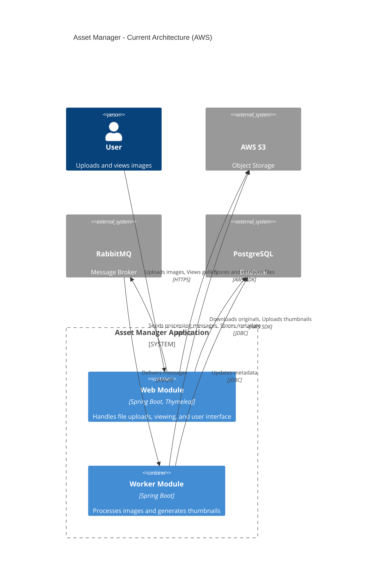
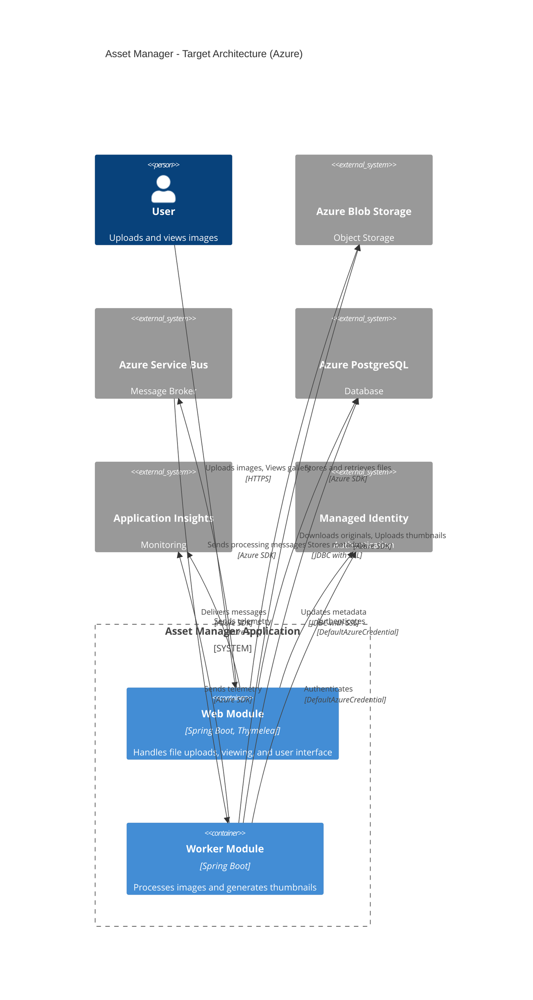
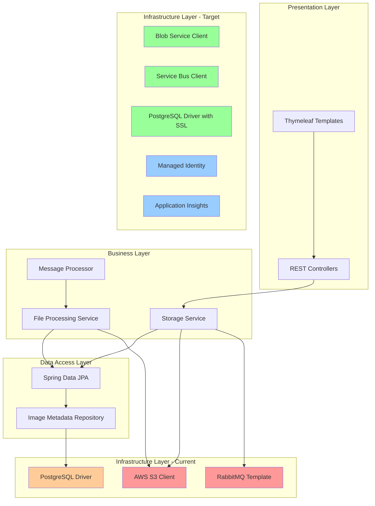
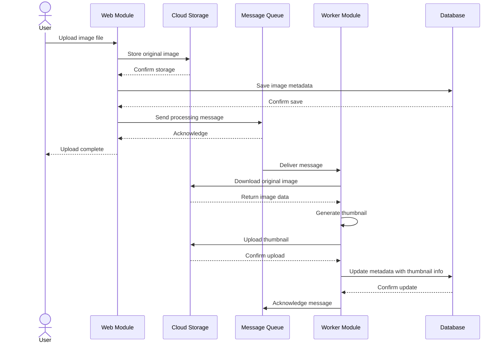
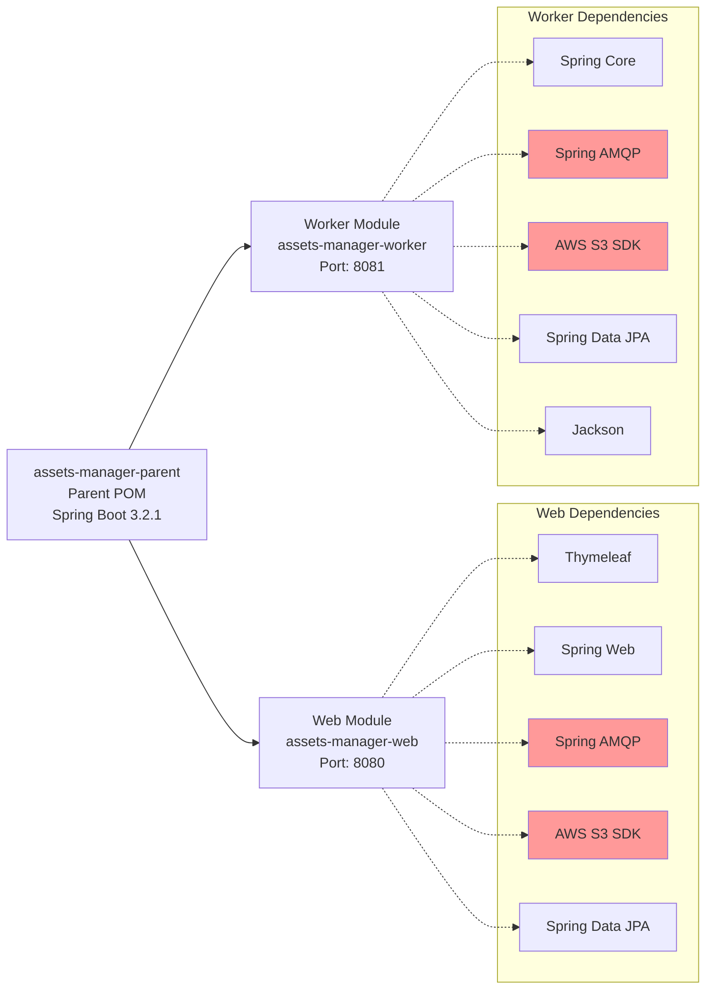
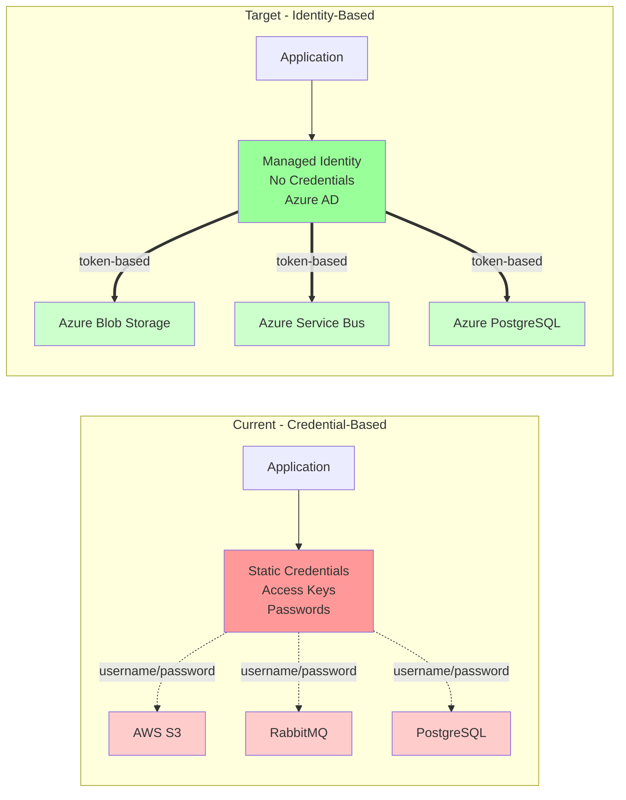

# Asset Manager - Architecture Diagram

## Application Overview

The Asset Manager is a multi-module Spring Boot application designed for cloud-based image asset management with asynchronous thumbnail processing.

## Architecture Type

- **Pattern**: Microservices / Multi-Module Application
- **Communication**: Message-Driven Architecture
- **Deployment**: Distributed Services

## Technology Stack

### Current Stack
- **Framework**: Spring Boot 3.2.1
- **Language**: Java 17
- **Build Tool**: Maven
- **Storage**: AWS S3 (password-based auth)
- **Messaging**: RabbitMQ (password-based auth)
- **Database**: PostgreSQL (password-based auth)
- **UI**: Thymeleaf
- **Data Access**: Spring Data JPA / Hibernate

### Target Stack (Azure Migration)
- **Framework**: Spring Boot 3.4.x
- **Language**: Java 17
- **Build Tool**: Maven
- **Storage**: Azure Blob Storage (Managed Identity)
- **Messaging**: Azure Service Bus (Managed Identity)
- **Database**: Azure Database for PostgreSQL (Managed Identity)
- **Monitoring**: Azure Application Insights
- **UI**: Thymeleaf
- **Data Access**: Spring Data JPA / Hibernate

## Current Architecture (C4 Model - Container Level)

## Target Architecture (C4 Model - Container Level)

## Application Layers

## Data Flow - Image Upload and Processing

## Module Structure

## Configuration Profiles

```mermaid
graph TB
    App[Asset Manager Application]
    
    subgraph "Development Profile"
        DevStorage[Local File System]
        DevQueue[Docker RabbitMQ]
        DevDB[Docker PostgreSQL]
    end
    
    subgraph "Default Profile - Current"
        ProdStorage[AWS S3]
        ProdQueue[RabbitMQ Server]
        ProdDB[PostgreSQL Server]
    end
    
    subgraph "Production Profile - Target"
        AzStorage[Azure Blob Storage]
        AzQueue[Azure Service Bus]
        AzDB[Azure PostgreSQL]
        AzMI[Managed Identity]
        AzAI[Application Insights]
    end
    
    App -->|dev profile| DevStorage
    App -->|dev profile| DevQueue
    App -->|dev profile| DevDB
    
    App -->|default profile| ProdStorage
    App -->|default profile| ProdQueue
    App -->|default profile| ProdDB
    
    App -->|azure profile| AzStorage
    App -->|azure profile| AzQueue
    App -->|azure profile| AzDB
    App -->|azure profile| AzMI
    App -->|azure profile| AzAI
    
    style ProdStorage fill:#ff9999
    style ProdQueue fill:#ff9999
    style AzStorage fill:#99ff99
    style AzQueue fill:#99ff99
    style AzDB fill:#99ff99
    style AzMI fill:#99ccff
    style AzAI fill:#99ccff
```

## Security Model Comparison

## Migration Impact Analysis

### High-Impact Changes

1. **Storage Layer** (7 story points)
   - Replace AWS S3 SDK with Azure Blob Storage SDK
   - Update all storage operations in both modules
   - Change configuration from bucket to container
   - Migrate authentication from access keys to Managed Identity

2. **Messaging Layer** (5 story points)
   - Replace RabbitMQ with Azure Service Bus
   - Update message sending and receiving logic
   - Convert queue configuration
   - Migrate authentication from username/password to Managed Identity

3. **Authentication** (3 story points)
   - Remove all hardcoded credentials
   - Implement DefaultAzureCredential
   - Update configuration files
   - Remove sensitive data from properties

### Medium-Impact Changes

4. **Database Configuration** (1 story point)
   - Update connection strings for Azure PostgreSQL
   - Enable SSL/TLS connections
   - Optional: Implement Managed Identity for database

5. **Monitoring** (2 story points)
   - Add Application Insights dependency
   - Configure distributed tracing
   - Add health check endpoints
   - Upgrade Spring Boot version

## Key Architecture Patterns

### Current Patterns
- **Multi-Module Maven Project**: Separation of concerns between web and worker
- **Message-Driven Architecture**: Asynchronous processing via message queue
- **Repository Pattern**: Spring Data JPA for data access
- **Profile-Based Configuration**: Different configs for dev vs production
- **Static Credential Authentication**: Username/password for all services

### Target Patterns (Post-Migration)
- **Multi-Module Maven Project**: Maintained
- **Message-Driven Architecture**: Maintained with Azure Service Bus
- **Repository Pattern**: Maintained
- **Profile-Based Configuration**: Enhanced with Azure-specific profiles
- **Managed Identity Authentication**: Passwordless, token-based auth
- **Distributed Tracing**: Application Insights integration

## Dependencies Summary

### Critical Dependencies (Require Migration)
- `software.amazon.awssdk:s3` → `com.azure:azure-storage-blob`
- `spring-boot-starter-amqp` → `spring-cloud-azure-starter-servicebus`

### Additional Dependencies (Recommended)
- `spring-cloud-azure-dependencies` (BOM for version management)
- `spring-cloud-azure-starter-monitor` (Application Insights)
- `spring-boot-starter-actuator` (Health checks)

### Unchanged Dependencies
- Spring Boot core dependencies
- Spring Data JPA
- PostgreSQL driver (with SSL configuration)
- Thymeleaf
- Lombok
- Jackson

## Cloud Readiness Assessment

### Current State
- **Cloud Readiness Score**: 62/100
- **Total Incidents**: 34
- **Critical Issues**: 7
- **Estimated Migration Effort**: 18 story points (3-4 weeks)

### Blockers
- Hardcoded credentials in configuration
- AWS-specific SDK usage throughout codebase
- RabbitMQ coupling in messaging layer
- No cloud-native monitoring

### Enablers
- Modern Spring Boot framework (3.2.1)
- Clean separation of concerns
- Profile-based configuration
- Standard JPA for database access
- No proprietary AWS features used

## Notes

- Both modules share similar migration patterns
- Storage and messaging changes are independent and can be parallelized
- Development profile (local file system) remains unchanged
- Database migration has minimal code impact
- No application logic changes required
- UI/UX remains completely unchanged
