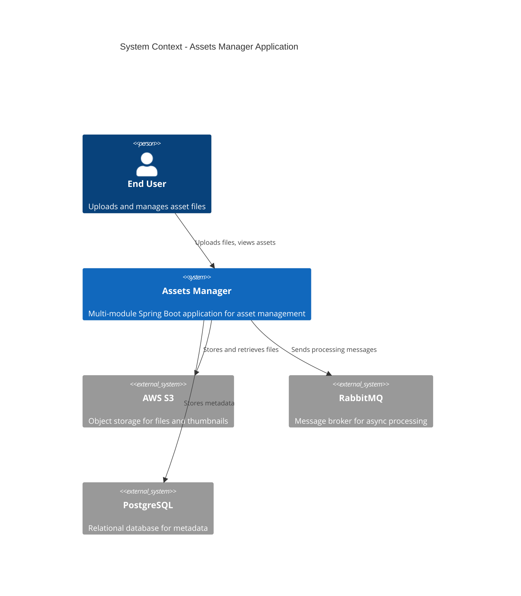
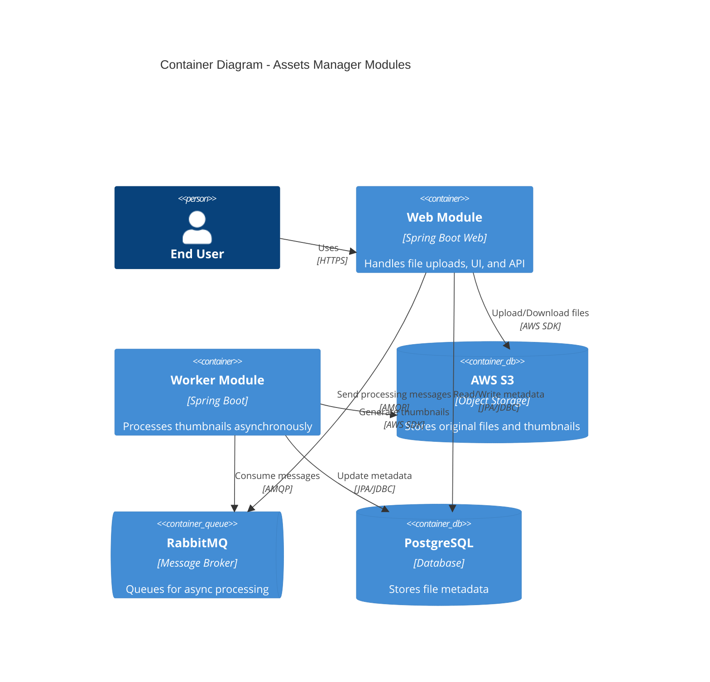
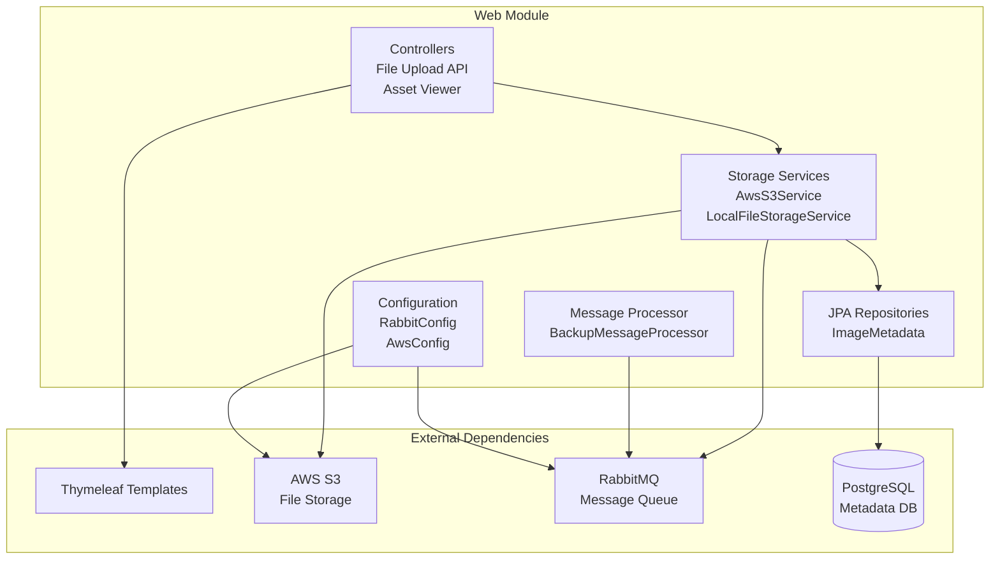
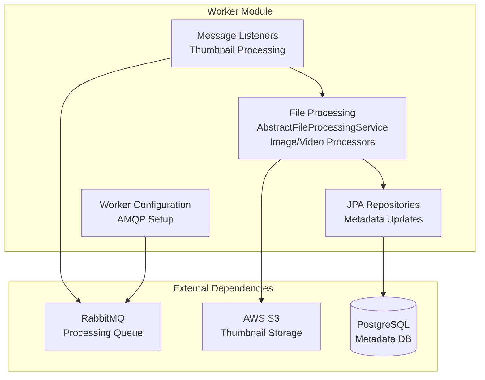
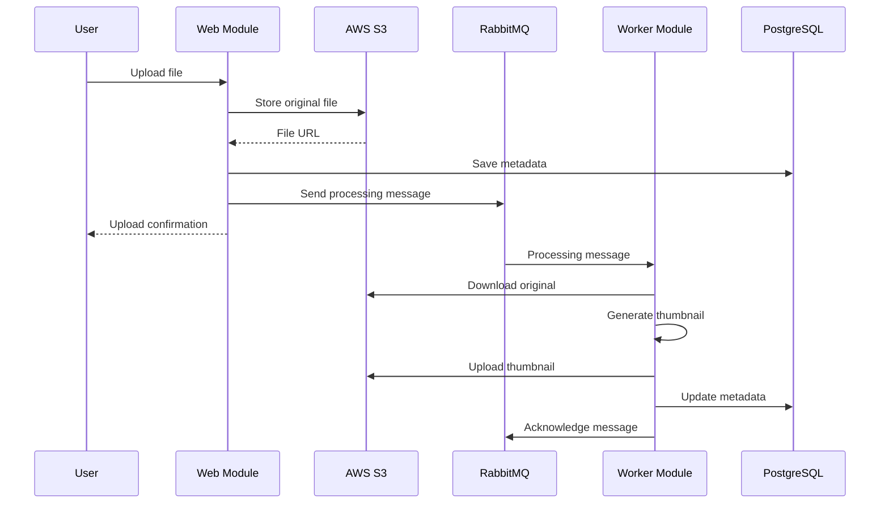
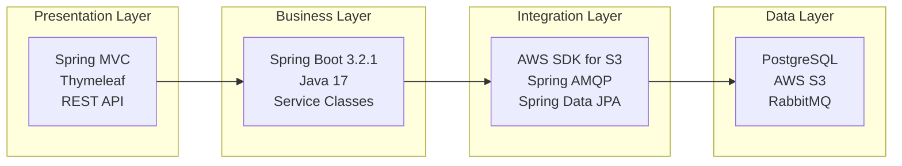
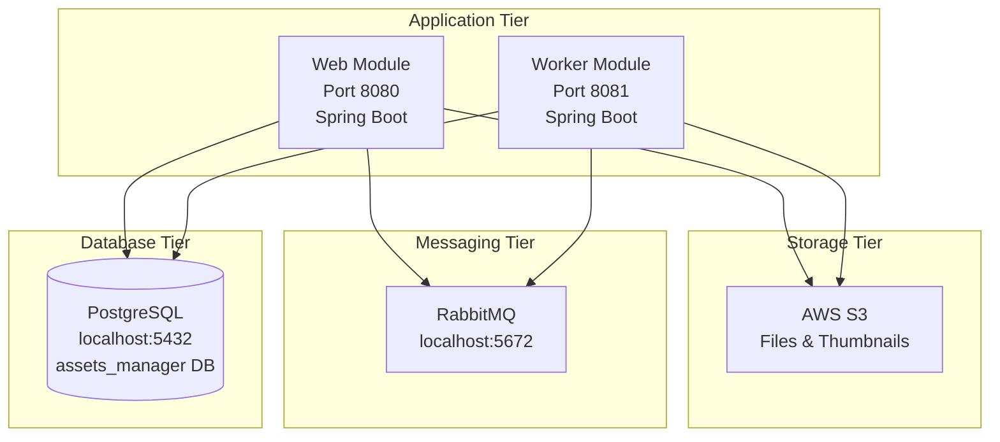
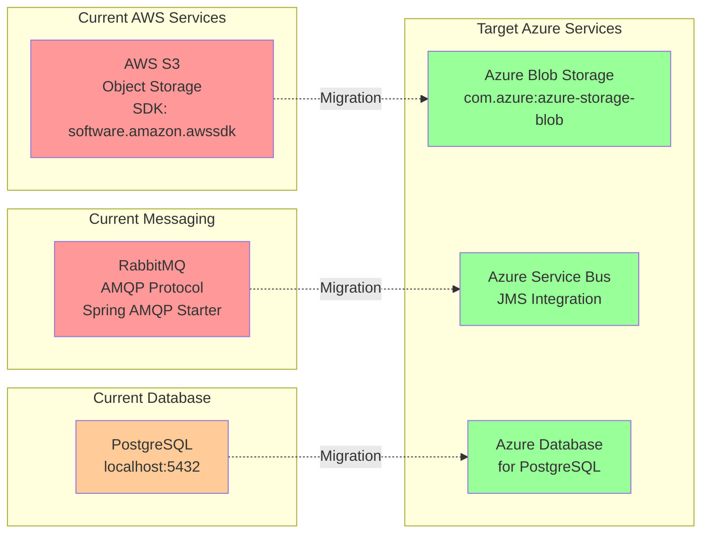

# Architecture Diagram - Assets Manager Application

## Overview

This document contains architecture diagrams for the Assets Manager application, a Spring Boot-based system for managing file uploads, storage, and thumbnail generation.

## Application Context

## Container Diagram

## Component Diagram - Web Module

## Component Diagram - Worker Module

## Data Flow - File Upload and Processing

## Technology Stack

## Current Architecture - Deployment View

## Migration Impact - Services to Replace

## Key Findings

### Application Architecture
- **Type**: Multi-module Spring Boot application
- **Modules**: 
  - Web Module: Handles user interface and file upload API
  - Worker Module: Asynchronous thumbnail generation
- **Pattern**: Event-driven architecture with message-based processing
- **Framework**: Spring Boot 3.2.1 with Spring MVC, Spring Data JPA, Spring AMQP

### Dependencies
- **Storage**: AWS S3 (software.amazon.awssdk:s3:2.25.13)
- **Messaging**: RabbitMQ via Spring Boot AMQP starter
- **Database**: PostgreSQL with Spring Data JPA
- **UI**: Thymeleaf template engine
- **Build Tool**: Maven multi-module project

### Integration Points
1. **AWS S3 Integration** (11 incidents)
   - File upload and download operations
   - Thumbnail storage
   - URL generation for file access
   - Used in both web and worker modules

2. **RabbitMQ Integration** (9 incidents)
   - Asynchronous message processing
   - Queue-based thumbnail generation
   - Manual message acknowledgment
   - Both producer and consumer patterns

3. **PostgreSQL Integration** (2 incidents)
   - File metadata storage
   - JPA entity management
   - Connection configuration

### Configuration Concerns
- Hardcoded AWS credentials in configuration files (4 incidents)
- Localhost-based service endpoints
- Plain text database passwords
- No secrets management

### Recommended Migration Path
1. **Phase 1**: Replace RabbitMQ with Azure Service Bus (JMS integration)
2. **Phase 2**: Migrate AWS S3 to Azure Blob Storage
3. **Phase 3**: Configure Azure Database for PostgreSQL
4. **Phase 4**: Implement Azure Managed Identity for authentication
5. **Phase 5**: Add Azure Application Insights for monitoring

## Diagram Notes

- All diagrams use Mermaid syntax compatible with GitHub rendering
- C4 diagrams provide context and container views
- Component diagrams show internal structure of each module
- Sequence diagram illustrates the file processing workflow
- Migration impact diagram highlights services requiring changes

