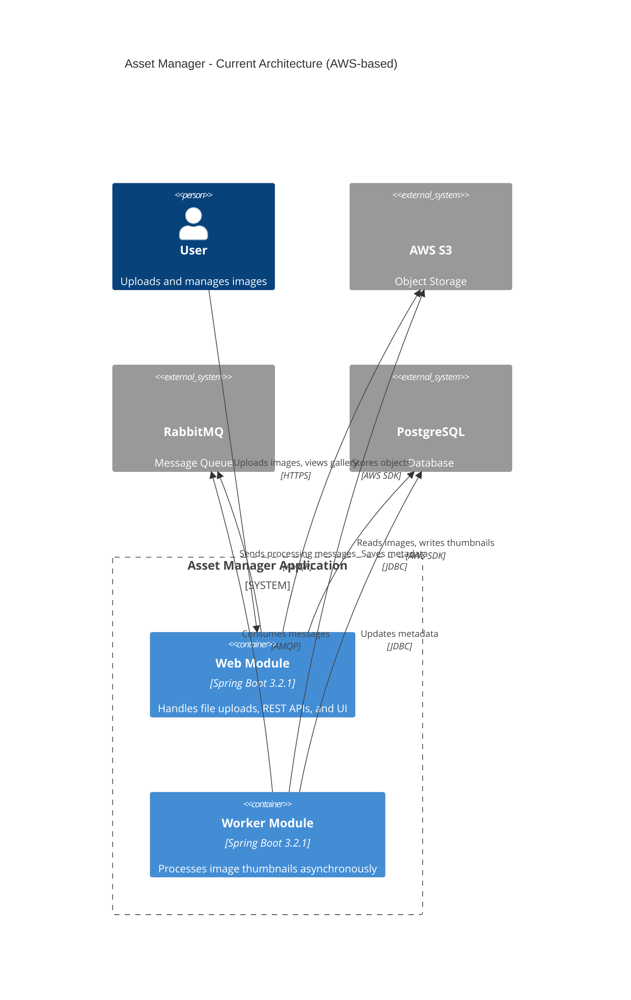
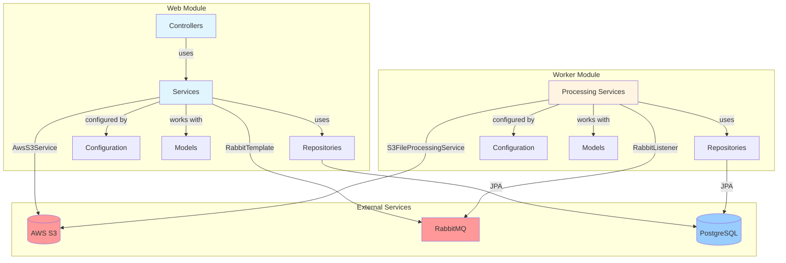
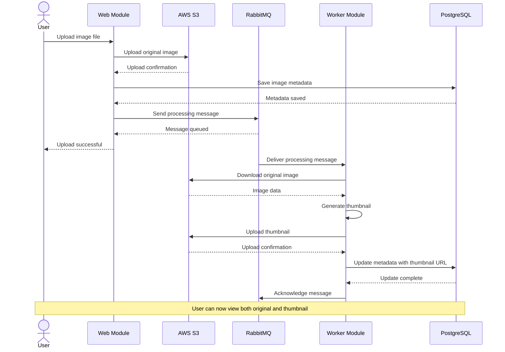
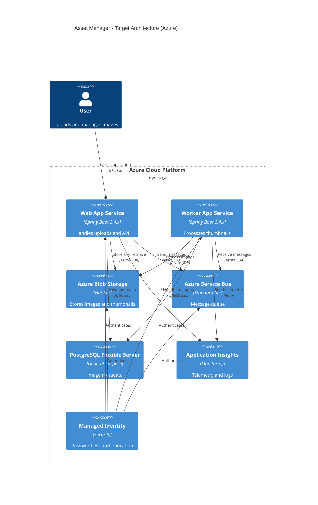
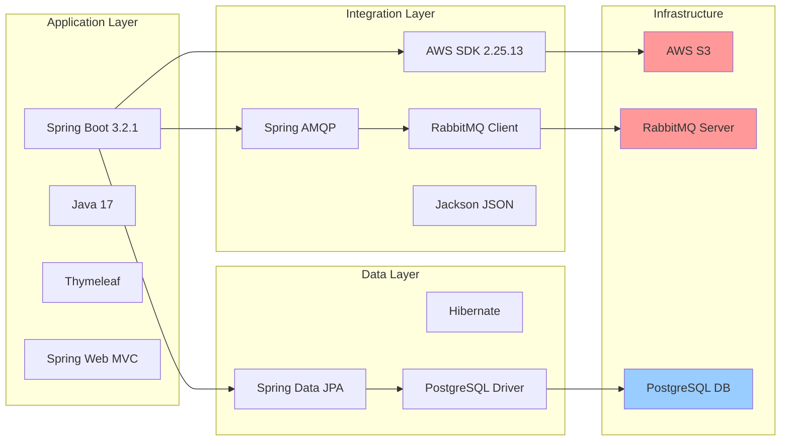
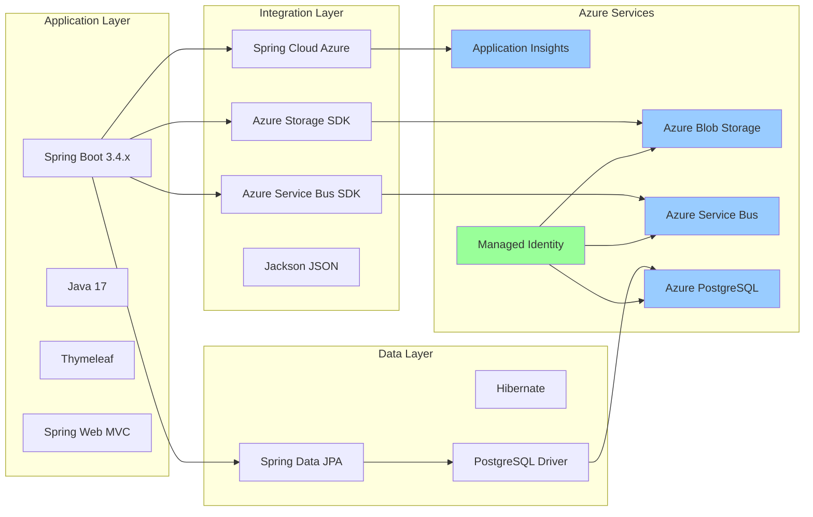
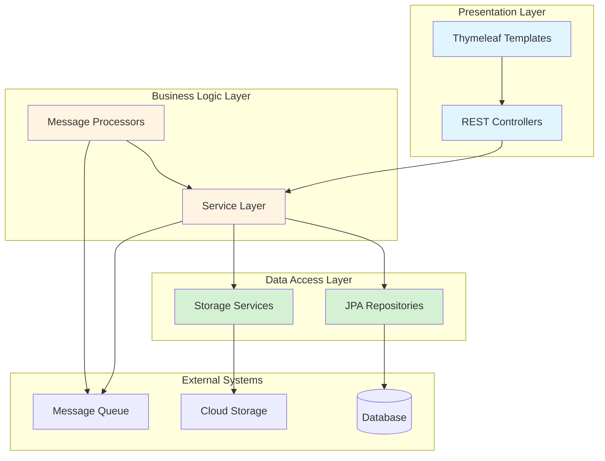
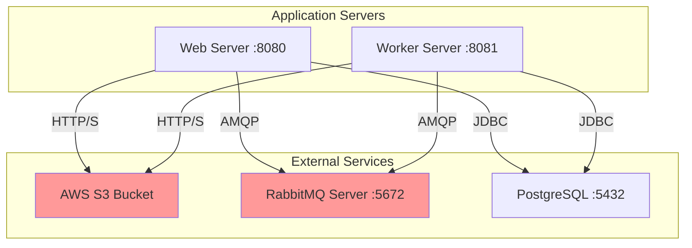
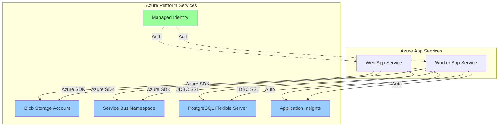

# Asset Manager - Architecture Diagrams

This document contains architecture diagrams for the Asset Manager application, generated from the assessment analysis.

## Table of Contents
- [Current Architecture Overview](#current-architecture-overview)
- [Application Component View](#application-component-view)
- [Data Flow Diagram](#data-flow-diagram)
- [Migration Target Architecture](#migration-target-architecture)
- [Technology Stack](#technology-stack)

---

## Current Architecture Overview

This diagram shows the high-level architecture of the Asset Manager application with its current AWS dependencies.

---

## Application Component View

This diagram shows the internal structure and components of each module.

---

## Data Flow Diagram

This diagram illustrates the complete flow of data through the system when a user uploads an image.

---

## Migration Target Architecture

This diagram shows the target Azure architecture after migration.

---

## Technology Stack

### Current Stack (AWS-based)

### Target Stack (Azure)

---

## Architecture Patterns

### Layer Architecture

---

## Key Architectural Decisions

### Multi-Module Design
- **Web Module**: Handles user interactions, file uploads, and API endpoints
- **Worker Module**: Dedicated to asynchronous image processing
- **Benefit**: Separation of concerns, independent scaling

### Profile-Based Configuration
- **dev profile**: Uses local file storage (LocalFileStorageService)
- **default profile**: Uses cloud storage (AwsS3Service / Future: AzureBlobService)
- **Benefit**: Easy development without cloud dependencies

### Asynchronous Processing
- Upload and thumbnail generation are decoupled via message queue
- User gets immediate feedback on upload
- Worker processes thumbnails in background
- **Benefit**: Better user experience, fault tolerance

### Storage Abstraction
- StorageService interface abstracts storage implementation
- Implementations: AwsS3Service, LocalFileStorageService
- **Migration Impact**: Only need to add AzureBlobStorageService implementation

---

## Migration Impact Analysis

### High Impact Components

1. **Storage Services** (Both Modules)
   - Current: `AwsS3Service` and `S3FileProcessingService`
   - Change: Replace AWS SDK with Azure Blob Storage SDK
   - Complexity: Medium - API translation required

2. **Message Queue** (Both Modules)
   - Current: RabbitMQ with Spring AMQP
   - Change: Azure Service Bus with Spring Cloud Azure
   - Complexity: Medium - Different programming model

3. **Authentication** (Both Modules)
   - Current: Static AWS credentials
   - Change: Azure Managed Identity (DefaultAzureCredential)
   - Complexity: Low - Simplified authentication model

### Medium Impact Components

1. **Configuration Classes**
   - `AwsS3Config` → `AzureBlobConfig`
   - `RabbitConfig` → `ServiceBusConfig`
   - Complexity: Low - Configuration changes only

2. **Database Connection**
   - Update connection strings for Azure PostgreSQL
   - Add SSL configuration
   - Complexity: Low - Minimal code changes

### Low Impact Components

1. **Controllers** - No changes required
2. **Models** - No changes required  
3. **Repositories** - No changes required
4. **Business Logic** - Minimal changes

---

## Deployment Architecture

### Current Deployment (Generic)

### Target Deployment (Azure)

---

## Summary

### Architecture Strengths
- ✅ Clean separation of concerns with multi-module design
- ✅ Abstraction layer for storage (StorageService interface)
- ✅ Asynchronous processing for better scalability
- ✅ Profile-based configuration for different environments
- ✅ Standard Spring Boot patterns and best practices

### Migration Considerations
- 🔄 Replace AWS SDK with Azure SDK (7 story points effort)
- 🔄 Migrate RabbitMQ to Azure Service Bus (5 story points effort)
- 🔄 Implement Azure Managed Identity (3 story points effort)
- 🔄 Configure Azure PostgreSQL (1 story point effort)
- 🔄 Add Application Insights (1 story point effort)
- 🔄 Upgrade Spring Boot version (2 story points effort)

**Total Migration Effort**: 18-19 story points (~3-4 weeks)

### Cloud Readiness Score: 62/100
- Strong foundation with Spring Boot and standard patterns
- Requires moderate effort to migrate cloud dependencies
- Good abstraction layers make migration more manageable
- Security improvements needed (Managed Identity vs static credentials)
