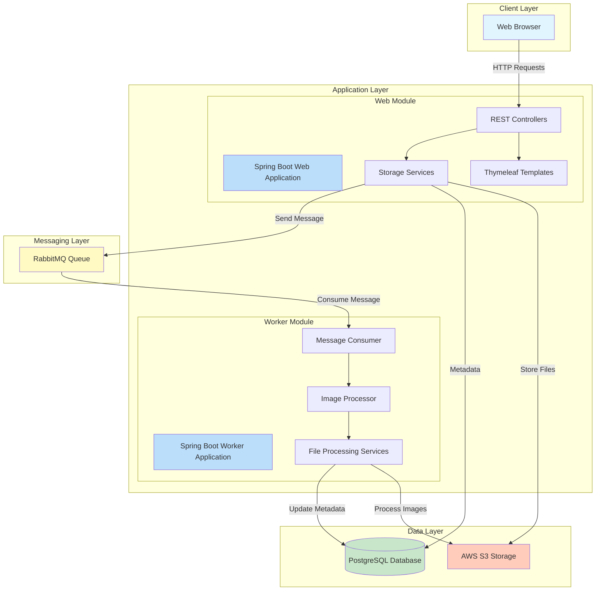
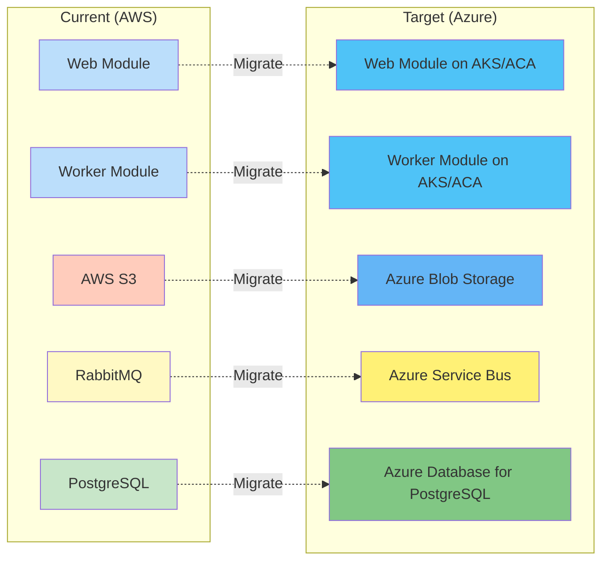

# Application Architecture Diagram

## Asset Manager Application

This diagram shows the high-level architecture of the Asset Manager application, a Spring Boot multi-module system for managing and processing image assets.



## Architecture Overview

### Technology Stack

| Layer | Technology | Purpose |
|-------|-----------|---------|
| **Framework** | Spring Boot 3.2.1 | Application framework |
| **Language** | Java 17 | Programming language |
| **Web** | Spring MVC + Thymeleaf | Web interface and REST APIs |
| **Messaging** | RabbitMQ (AMQP) | Async communication between modules |
| **Database** | PostgreSQL + Spring Data JPA | Metadata persistence |
| **Storage** | AWS S3 SDK | Object storage for images |
| **Build** | Maven | Build and dependency management |

### Application Modules

#### 1. Web Module (assets-manager-web)
**Responsibilities:**
- Serve web UI for image management
- Handle file uploads via REST controllers
- Store original images to S3
- Save metadata to PostgreSQL
- Send processing messages to queue

**Key Components:**
- `S3Controller` - Handles upload/download/delete operations
- `HomeController` - Serves main UI
- `AwsS3Service` - Interfaces with AWS S3
- `LocalFileStorageService` - Local storage for development
- `ImageMetadataRepository` - JPA repository for metadata

#### 2. Worker Module (assets-manager-worker)
**Responsibilities:**
- Consume messages from RabbitMQ queue
- Generate thumbnails from uploaded images
- Store processed images back to S3
- Update processing status in database

**Key Components:**
- `MessageConsumer` - Listens to RabbitMQ
- `S3FileProcessingService` - Processes images from S3
- `LocalFileProcessingService` - Local processing for development
- `ImageMetadataRepository` - JPA repository for metadata

### Data Flow

1. **Upload Flow:**
   ```
   User → Web UI → Upload Controller → S3 Service → AWS S3
                                     ↓
                              Save Metadata → PostgreSQL
                                     ↓
                              Send Message → RabbitMQ
   ```

2. **Processing Flow:**
   ```
   RabbitMQ → Message Consumer → Image Processor → S3 Service → AWS S3 (thumbnail)
                                                              ↓
                                                    Update Metadata → PostgreSQL
   ```

3. **View Flow:**
   ```
   User → Web UI → View Controller → S3 Service → AWS S3 → Stream Image → User
   ```

### External Dependencies

| Service | Usage | Migration Path |
|---------|-------|----------------|
| **AWS S3** | Object storage for images and thumbnails | → Azure Blob Storage |
| **RabbitMQ** | Message queue for async processing | → Azure Service Bus |
| **PostgreSQL** | Relational database for metadata | → Azure Database for PostgreSQL |

### Configuration Profiles

The application supports multiple profiles for different environments:

- **dev** - Uses local file storage and H2 database for development
- **default** - Uses AWS S3, RabbitMQ, and PostgreSQL for production

### Security Considerations

- ⚠️ No authentication/authorization currently implemented
- ⚠️ All endpoints are publicly accessible
- 🔒 Recommended: Implement Azure AD authentication before production

### Deployment Architecture



## Migration Readiness

### Cloud Readiness Score: 65/100

**Strengths:**
- ✅ Modern Spring Boot 3.x framework
- ✅ Multi-module architecture separates concerns
- ✅ Profile-based configuration supports multiple environments
- ✅ Uses standard JPA for data access (database agnostic)
- ✅ Async messaging pattern already in place

**Migration Required:**
- 🔄 Replace AWS S3 SDK with Azure Blob Storage SDK
- 🔄 Replace RabbitMQ with Azure Service Bus
- 🔄 Update database connection for Azure PostgreSQL
- 🔄 Implement Azure AD authentication
- 🔄 Add Azure Application Insights for monitoring

**Estimated Migration Effort:** 2-3 weeks

## Next Steps

1. Review detailed assessment report at `.github/modernize/report.json`
2. Create modernization plan to address identified issues
3. Prioritize critical migrations (AWS S3 → Azure Blob, RabbitMQ → Service Bus)
4. Implement Azure AD authentication
5. Add monitoring and observability with Application Insights
6. Deploy to Azure Container Apps or Azure Kubernetes Service

---

*Generated: 2026-02-11*
*Assessment Tool: Application Assessment Skill v1.0*
