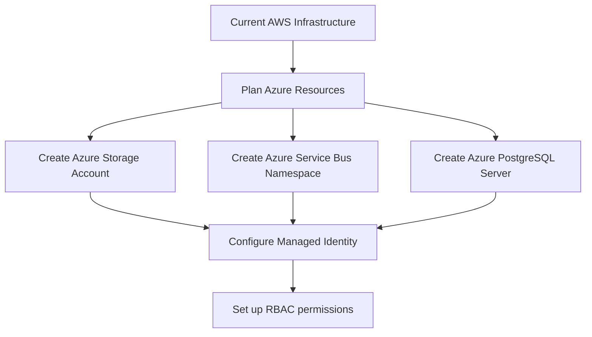
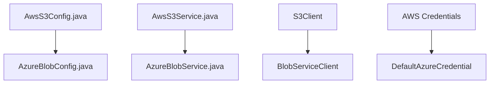

# Modernization Planning Template: AWS to Azure Migration

## Executive Summary

This assessment analyzes the migration of the Asset Manager application from AWS to Azure services. The application consists of a web module for file uploads/viewing and a worker module for thumbnail generation, currently using AWS S3, RabbitMQ, and PostgreSQL with password-based authentication. The modernization will migrate to Azure Blob Storage, Azure Service Bus, and Azure Database for PostgreSQL using managed identity authentication.

## Current State Analysis

### Current Architecture Components

#### Web Module (assets-manager-web)
- **Storage**: AWS S3 for image storage using AWS SDK v2.25.13
- **Messaging**: RabbitMQ using Spring Boot Starter AMQP
- **Database**: PostgreSQL using Spring Boot Starter Data JPA
- **Authentication**: Password-based (access key/secret key for S3, username/password for RabbitMQ and PostgreSQL)

#### Worker Module (assets-manager-worker) 
- **Storage**: AWS S3 for image download/upload
- **Messaging**: RabbitMQ for message consumption
- **Database**: PostgreSQL for metadata operations
- **Authentication**: Password-based authentication

### Current Dependencies
```xml
<!-- AWS SDK -->
<dependency>
    <groupId>software.amazon.awssdk</groupId>
    <artifactId>s3</artifactId>
    <version>2.25.13</version>
</dependency>

<!-- Messaging -->
<dependency>
    <groupId>org.springframework.boot</groupId>
    <artifactId>spring-boot-starter-amqp</artifactId>
</dependency>

<!-- Database -->
<dependency>
    <groupId>org.springframework.boot</groupId>
    <artifactId>spring-boot-starter-data-jpa</artifactId>
</dependency>
<dependency>
    <groupId>org.postgresql</groupId>
    <artifactId>postgresql</artifactId>
</dependency>
```

### Current Configuration Files Identified
- `web/src/main/java/com/microsoft/migration/assets/config/AwsS3Config.java`
- `web/src/main/java/com/microsoft/migration/assets/config/RabbitConfig.java`  
- `web/src/main/resources/application.properties`
- `worker/src/main/resources/application.properties`

### Current Service Implementations
- `AwsS3Service.java` - S3 operations (upload, download, delete, list)
- `BackupMessageProcessor.java` - RabbitMQ message processing
- `LocalFileStorageService.java` - Local storage fallback

## Target State Architecture

### Azure Services Mapping
- **AWS S3** → **Azure Blob Storage** with managed identity
- **RabbitMQ** → **Azure Service Bus** with managed identity  
- **PostgreSQL** → **Azure Database for PostgreSQL** with managed identity

### Target Dependencies
```xml
<!-- Azure Storage -->
<dependency>
    <groupId>com.azure</groupId>
    <artifactId>azure-storage-blob</artifactId>
    <version>12.29.0</version>
</dependency>
<dependency>
    <groupId>com.azure</groupId>
    <artifactId>azure-identity</artifactId>
    <version>1.15.4</version>
</dependency>

<!-- Azure Service Bus -->
<dependency>
    <groupId>com.azure.spring</groupId>
    <artifactId>spring-cloud-azure-starter</artifactId>
</dependency>
<dependency>
    <groupId>com.azure.spring</groupId>
    <artifactId>spring-messaging-azure-servicebus</artifactId>
</dependency>

<!-- Database (no change needed) -->
<dependency>
    <groupId>org.springframework.boot</groupId>
    <artifactId>spring-boot-starter-data-jpa</artifactId>
</dependency>
<dependency>
    <groupId>org.postgresql</groupId>
    <artifactId>postgresql</artifactId>
</dependency>
```

## Modernization Sequencing

| Order | From (AWS) | To (Azure) | Dependencies | Migration Type | Risk Level | Description | Necessity |
|-------|------------|------------|--------------|-------------|------------|-------------|-----------|
| 1 | Infrastructure Planning | Azure Resource Planning | None | Infrastructure Setup | Low | Plan and create Azure resources: Storage Account, Service Bus namespace, PostgreSQL server with managed identity enabled | Mandatory |
| 2 | Maven Dependencies | Azure SDK Dependencies | Step 1 | Application Code Change | Low | Update pom.xml files to replace AWS SDK with Azure SDKs and add managed identity dependencies | Mandatory |
| 3 | AWS S3 Configuration | Azure Blob Storage Configuration | Step 2 | Configuration | Medium | Replace AwsS3Config.java with Azure Blob Storage configuration using DefaultAzureCredential | Mandatory |
| 4 | AWS S3 Service Implementation | Azure Blob Storage Service | Step 3 | Application Code Change | High | Replace AwsS3Service.java with Azure Blob Storage implementation, maintaining same interface | Mandatory |
| 5 | RabbitMQ Configuration | Azure Service Bus Configuration | Step 2 | Configuration | Medium | Replace RabbitConfig.java with Azure Service Bus configuration using managed identity | Mandatory |
| 6 | RabbitMQ Message Processing | Azure Service Bus Message Processing | Step 5 | Application Code Change | High | Update BackupMessageProcessor.java to use Azure Service Bus annotations and message handling | Mandatory |
| 7 | Application Properties | Azure Configuration Properties | Steps 3,5 | Configuration | Low | Update application.properties files with Azure service endpoints and managed identity settings | Mandatory |
| 8 | Database Connection | Azure PostgreSQL with Managed Identity | Step 1 | Configuration | Medium | Update database connection to use Azure Database for PostgreSQL with managed identity authentication | Optional |
| 9 | Integration Testing | Azure Services Testing | Steps 1-8 | Manual Action | Medium | Validate all Azure services integration and functionality | Mandatory |
| 10 | Deployment Configuration | Azure Deployment Setup | Steps 1-9 | Deployment | Low | Update deployment scripts and configurations for Azure environment | Mandatory |

## Detailed Migration Steps

### Step 1: Infrastructure Setup


**Prerequisites**: Azure subscription with appropriate permissions
**Implementation**:
- Create Azure Storage Account with blob containers
- Create Azure Service Bus namespace with queues/topics
- Create Azure Database for PostgreSQL with managed identity
- Configure RBAC permissions for the application identity

**Validation**: Verify all resources are created and accessible

### Step 2: Dependencies Update
**Implementation**:
- Add Azure Storage Blob SDK
- Add Azure Identity SDK  
- Add Azure Service Bus Spring Integration
- Remove AWS SDK dependencies
- Add Spring Cloud Azure BOM for version management

**Validation**: Maven build succeeds without dependency conflicts

### Step 3: Storage Service Migration


**Implementation**:
- Replace `AwsS3Config.java` with `AzureBlobConfig.java`
- Implement `AzureBlobService.java` with equivalent methods
- Use `BlobServiceClient` instead of `S3Client`
- Implement managed identity authentication

**Validation**: Storage operations (upload, download, delete, list) work correctly

### Step 4: Messaging Service Migration
```mermaid
flowchart TD
    A[RabbitConfig.java] --> B[ServiceBusConfig.java]
    C[RabbitTemplate] --> D[ServiceBusTemplate]
    E[@RabbitListener] --> F[@ServiceBusListener]
    G[AMQP Messages] --> H[Service Bus Messages]
```

**Implementation**:
- Replace `RabbitConfig.java` with Service Bus configuration
- Update `BackupMessageProcessor.java` to use `@ServiceBusListener`
- Replace `RabbitTemplate` with `ServiceBusTemplate`
- Add `@EnableAzureMessaging` annotation

**Validation**: Message queuing and processing works correctly

### Step 5: Configuration Migration
**Implementation**:
- Update application.properties with Azure endpoints
- Configure managed identity settings
- Remove AWS-specific configurations
- Add Azure Service Bus and Blob Storage configurations

**Validation**: Application starts successfully with new configurations

## Risk Assessment and Mitigation

### High Risk Areas

1. **Service Interface Compatibility**
   - **Risk**: Azure services may have different API signatures than AWS
   - **Mitigation**: Maintain existing service interfaces, implement Azure-specific logic internally
   - **Contingency**: Create adapter patterns if significant API differences exist

2. **Message Format Compatibility**
   - **Risk**: Azure Service Bus message format may differ from RabbitMQ
   - **Mitigation**: Test message serialization/deserialization thoroughly
   - **Contingency**: Implement message format adapters if needed

3. **Managed Identity Configuration**
   - **Risk**: Incorrect RBAC setup could prevent service access
   - **Mitigation**: Test managed identity access in development environment first
   - **Contingency**: Fallback to connection strings during development/testing

### Medium Risk Areas

1. **Database Connection Changes**
   - **Risk**: PostgreSQL connection strings and authentication may need updates
   - **Mitigation**: Test database connectivity with Azure Database for PostgreSQL
   - **Contingency**: Keep current connection method as fallback

2. **Performance Differences**
   - **Risk**: Azure services may have different performance characteristics
   - **Mitigation**: Conduct performance testing after migration
   - **Contingency**: Optimize configurations based on performance test results

### Low Risk Areas

1. **Configuration Management**
   - **Risk**: Minor configuration changes needed
   - **Mitigation**: Document all configuration changes clearly
   - **Contingency**: Maintain backup of original configurations

## Success Criteria and Validation

### Functional Success Criteria
1. **File Upload/Download**: All file operations work correctly with Azure Blob Storage
2. **Thumbnail Generation**: Worker service processes messages from Azure Service Bus successfully
3. **Database Operations**: All CRUD operations work with Azure Database for PostgreSQL
4. **Authentication**: Managed identity authentication works for all Azure services

### Performance Success Criteria
1. **Response Time**: File upload/download response times within 10% of current performance
2. **Throughput**: Message processing throughput maintained or improved
3. **Storage Access**: Blob storage access times comparable to S3 performance

### Security Success Criteria
1. **Managed Identity**: No hardcoded credentials in configuration or code
2. **RBAC**: Proper role-based access control configured for all services
3. **Network Security**: Secure communication between all Azure services

### Validation Approach
1. **Unit Tests**: Update existing tests to work with Azure services
2. **Integration Tests**: Comprehensive testing of all Azure service interactions
3. **Performance Tests**: Load testing to validate performance criteria
4. **Security Tests**: Penetration testing to validate security improvements

## Implementation Timeline

### Phase 1: Infrastructure Setup (Week 1)
- Create Azure resources
- Configure managed identity and RBAC
- Set up development environment

### Phase 2: Code Migration (Week 2-3)
- Update dependencies
- Migrate storage service implementation
- Migrate messaging service implementation
- Update configurations

### Phase 3: Testing and Validation (Week 4)
- Comprehensive testing
- Performance validation
- Security validation
- Bug fixes and optimization

### Phase 4: Deployment (Week 5)
- Production deployment
- Monitoring setup
- Go-live support

## Rollback Strategy

1. **Infrastructure**: Keep AWS resources active during initial deployment
2. **Code**: Maintain feature flags to switch between AWS and Azure implementations
3. **Data**: Ensure data synchronization capabilities between AWS S3 and Azure Blob Storage
4. **Configuration**: Maintain separate configuration profiles for AWS and Azure

## Post-Migration Considerations

1. **Monitoring**: Set up Azure Monitor for application and service monitoring
2. **Cost Optimization**: Review and optimize Azure service configurations for cost efficiency
3. **Security Hardening**: Implement additional security measures as needed
4. **Documentation**: Update all documentation to reflect Azure implementation
5. **Training**: Provide team training on Azure services and management

## Conclusion

This migration from AWS to Azure services will modernize the authentication approach from password-based to managed identity, improving security and reducing credential management overhead. The modular approach ensures minimal disruption while providing clear rollback options. The estimated timeline of 5 weeks allows for thorough testing and validation of the migration.