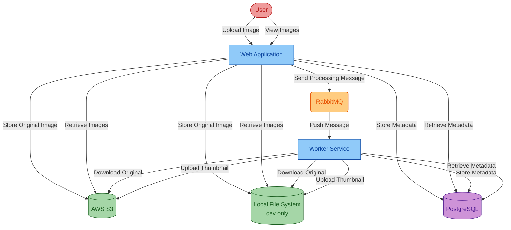
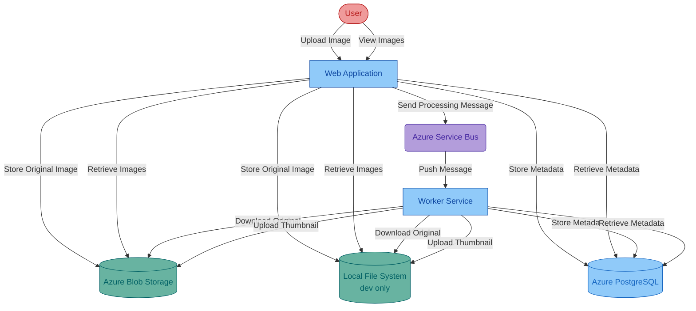

# Asset Manager
Sample project for migration tool code remediation that manages assets in cloud storage.

## Migration Status

✅ **COMPLETED: AWS S3 to Azure Blob Storage Migration**

The application now supports both AWS S3 and Azure Blob Storage through a configurable interface. The migration maintains full backward compatibility while adding Azure support.

### What's Migrated
- ✅ File upload/download operations
- ✅ Thumbnail generation and storage
- ✅ Metadata management with generic storage fields
- ✅ SAS token generation for secure access
- ✅ Managed identity authentication support

### Still Using Legacy (Will be migrated later)
- 🔄 RabbitMQ → Azure Service Bus (planned)
- 🔄 PostgreSQL → Azure Database for PostgreSQL (planned)

## Configuration

### Azure Blob Storage (Production)
```properties
# Azure Storage Account Configuration
azure.storage.account.endpoint=https://yourstorageaccount.blob.core.windows.net
azure.storage.container.name=your-container-name

# Use production profile to enable Azure Blob Storage
spring.profiles.active=prod
```

### AWS S3 (Legacy Support)
```properties
# AWS S3 Configuration (Legacy)
aws.accessKey=your-access-key
aws.secretKey=your-secret-key
aws.region=us-east-1
aws.s3.bucket=your-bucket-name

# Use production profile but ensure AWS services are available
spring.profiles.active=prod
```

### Local Development
```properties
# Use dev profile for local file storage
spring.profiles.active=dev
local.storage.directory=../storage
```

## Authentication

### Azure Managed Identity (Recommended)
The application uses `DefaultAzureCredential` which supports:
- Managed Identity (when deployed to Azure)
- Azure CLI credentials (for local development)
- Service Principal with environment variables
- Visual Studio Code Azure Account

### Setup for Local Development
1. Install Azure CLI: `az login`
2. Set environment variables:
   ```bash
   export AZURE_STORAGE_ACCOUNT_ENDPOINT=https://youraccount.blob.core.windows.net
   ```
3. Run with prod profile: `mvn spring-boot:run -Dspring.profiles.active=prod`

## Current Infrastructure
The project currently uses the following infrastructure:
* AWS S3 for image storage, using password-based authentication (access key/secret key)
* RabbitMQ for message queuing, using password-based authentication
* PostgreSQL database for metadata storage, using password-based authentication

## Current Architecture

Password-based authentication

## Migrated Infrastructure
After migration, the project will use the following Azure services:
* Azure Blob Storage for image storage, using managed identity authentication
* Azure Service Bus for message queuing, using managed identity authentication
* Azure Database for PostgreSQL for metadata storage, using managed identity authentication

## Migrated Architecture

Managed identity based authentication

## Run Locally

**Prerequisites**: JDK, Docker

Run the following commands to start the apps locally. This will:
* Use local file system instead of S3 to store the image
* Launch RabbitMQ and PostgreSQL using Docker

Windows:

```batch
cd asset-manager
scripts\start.cmd
```

Linux:

```sh
cd asset-manager
scripts/start.sh
```

To stop, run `stop.cmd` or `stop.sh` in the `scripts` directory.