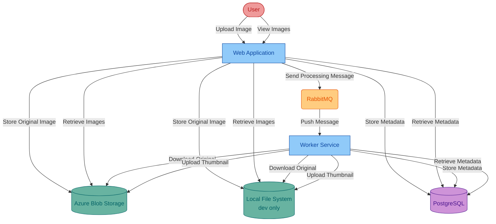

# Asset Manager
Sample project for migration tool code remediation that manages assets in cloud storage.

## Current Infrastructure
The project has been migrated to use the following infrastructure:
* **Azure Storage Account** for image storage, using managed identity authentication (DefaultAzureCredential)
* RabbitMQ for message queuing, using password-based authentication
* PostgreSQL database for metadata storage, using password-based authentication

### Legacy Support
* AWS S3 support is maintained for backward compatibility when using `s3` or `legacy` profiles

## Current Architecture

Managed identity based authentication

## Migrated Infrastructure
After migration, the project will use the following Azure services:
* Azure Blob Storage for image storage, using managed identity authentication
* Azure Service Bus for message queuing, using managed identity authentication
* Azure Database for PostgreSQL for metadata storage, using managed identity authentication

## Migrated Architecture

Managed identity based authentication

## Configuration

### Azure Storage Account Configuration
For production deployments, configure the following properties in `application.properties`:

```properties
# Azure Storage Account Configuration
azure.storage.account.endpoint=https://yourstorageaccount.blob.core.windows.net
azure.storage.container.name=your-container-name
```

**Authentication**: The application uses `DefaultAzureCredential` for authentication, which supports:
- Managed Identity (recommended for Azure deployments)
- Azure CLI authentication (for local development)
- Environment variables (`AZURE_CLIENT_ID`, `AZURE_CLIENT_SECRET`, `AZURE_TENANT_ID`)

### Profile Configuration
- **Default (production)**: Uses Azure Storage Account
- **dev**: Uses local file system storage
- **s3** or **legacy**: Uses AWS S3 (for backward compatibility)

To use S3 instead of Azure Storage Account, activate the `s3` profile:
```properties
spring.profiles.active=s3
```

### Legacy AWS S3 Configuration (optional)
```properties
# AWS S3 Configuration (only needed when using s3/legacy profiles)
aws.accessKey=your-access-key
aws.secretKey=your-secret-key
aws.region=us-east-1
aws.s3.bucket=your-bucket-name
```

## Run Locally

**Prerequisites**: JDK, Docker

Run the following commands to start the apps locally. This will:
* Use local file system instead of Azure Storage Account to store the image
* Launch RabbitMQ and PostgreSQL using Docker

Windows:

```batch
cd asset-manager
scripts\start.cmd
```

Linux:

```sh
cd asset-manager
scripts/start.sh
```

To stop, run `stop.cmd` or `stop.sh` in the `scripts` directory.