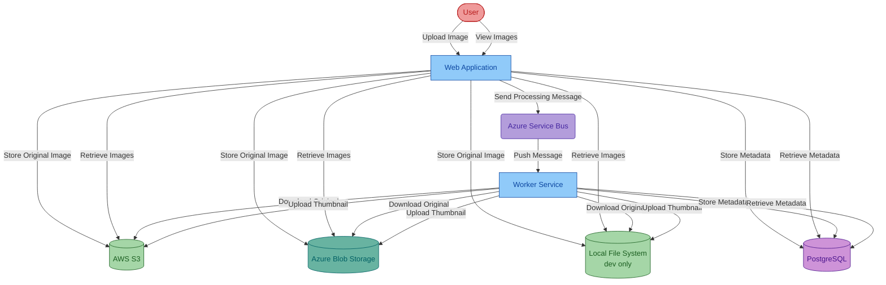

# Asset Manager
Sample project for migration tool code remediation that manages assets in cloud storage.

## Current Infrastructure
The project has been migrated to use the following Azure infrastructure:
* Azure Blob Storage for image storage (AWS S3 can still be used), using managed identity authentication
* Azure Service Bus for message queuing, using managed identity authentication  
* PostgreSQL database for metadata storage, using password-based authentication

## Architecture

```mermaid
flowchart TD

%% Applications
WebApp[Web Application]
Worker[Worker Service]

%% Storage Components  
S3[(AWS S3)]
AzBlob[(Azure Blob Storage)]
LocalFS[("Local File System<br/>dev only")]

%% Message Broker
ServiceBus(Azure Service Bus)

%% Database
PostgreSQL[(PostgreSQL)]

%% User
User([User])

%% User Flow
User -->|Upload Image| WebApp
User -->|View Images| WebApp

%% Web App Flows
WebApp -->|Store Original Image| S3
WebApp -->|Store Original Image| AzBlob
WebApp -->|Store Original Image| LocalFS
WebApp -->|Send Processing Message| ServiceBus
WebApp -->|Store Metadata| PostgreSQL
WebApp -->|Retrieve Images| S3
WebApp -->|Retrieve Images| AzBlob
WebApp -->|Retrieve Images| LocalFS
WebApp -->|Retrieve Metadata| PostgreSQL

%% Service Bus Flow
ServiceBus -->|Push Message| Worker

%% Worker Flow
Worker -->|Download Original| S3
Worker -->|Download Original| AzBlob
Worker -->|Download Original| LocalFS
Worker -->|Upload Thumbnail| S3
Worker -->|Upload Thumbnail| AzBlob
Worker -->|Upload Thumbnail| LocalFS
Worker -->|Store Metadata| PostgreSQL
Worker -->|Retrieve Metadata| PostgreSQL

%% Styling
classDef app fill:#90caf9,stroke:#0d47a1,color:#0d47a1
classDef storage fill:#a5d6a7,stroke:#1b5e20,color:#1b5e20
classDef azurestorage fill:#68B3A1,stroke:#006064,color:#006064
classDef broker fill:#B39DDB,stroke:#4527A0,color:#4527A0
classDef db fill:#ce93d8,stroke:#4a148c,color:#4a148c
classDef queue fill:#fff59d,stroke:#f57f17,color:#f57f17
classDef user fill:#ef9a9a,stroke:#b71c1c,color:#b71c1c

class WebApp,Worker app
class S3,LocalFS storage
class AzBlob azurestorage
class ServiceBus broker
class PostgreSQL db
class Queue,RetryQueue queue
class User user
```

## Azure Service Bus Configuration

The application now uses Azure Service Bus instead of RabbitMQ for message queuing. To configure Azure Service Bus:

### Environment Variables Required:
- `AZURE_CLIENT_ID`: The client ID of the managed identity
- `SERVICE_BUS_NAMESPACE`: The fully qualified namespace of your Service Bus (e.g., `myservicebus.servicebus.windows.net`)

### Configuration Properties:
```properties
# Azure Service Bus Configuration
spring.cloud.azure.credential.managed-identity-enabled=true
spring.cloud.azure.credential.client-id=${AZURE_CLIENT_ID}
spring.cloud.azure.servicebus.entity-type=queue
spring.cloud.azure.servicebus.namespace=${SERVICE_BUS_NAMESPACE}
```

### Key Features:
- **Managed Identity Authentication**: No connection strings or passwords required
- **Automatic Queue Creation**: Queues are created automatically if they don't exist
- **Retry Logic**: Built-in retry mechanism with exponential backoff
- **Manual Acknowledgment**: Messages are acknowledged manually for reliability

### Migration from RabbitMQ:
- Queue name remains the same: `image-processing`
- Message format unchanged: JSON serialization of `ImageProcessingMessage`
- Retry logic preserved: 3 attempts with 1-minute delay
- Manual acknowledgment mode maintained for reliability

## Run Locally

**Prerequisites**: JDK, Docker

Run the following commands to start the apps locally. This will:
* Use local file system instead of cloud storage to store images
* Launch PostgreSQL using Docker  
* Use Azure Service Bus for message queuing (requires Azure setup)

### Setup Azure Service Bus (Required)

1. Create an Azure Service Bus namespace
2. Create a managed identity and assign it Service Bus Data Owner role
3. Set environment variables:
   ```bash
   export AZURE_CLIENT_ID="your-managed-identity-client-id"
   export SERVICE_BUS_NAMESPACE="yournamespace.servicebus.windows.net"
   ```

### Start the Applications

Windows:

```batch
cd asset-manager
scripts\start.cmd
```

Linux:

```sh
cd asset-manager
scripts/start.sh
```

To stop, run `stop.cmd` or `stop.sh` in the `scripts` directory.

### Development Mode

For local development without Azure Service Bus, you can temporarily modify the configuration to use a local message broker or implement a simple in-memory queue for testing.