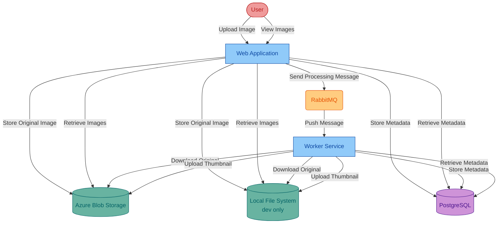

# Asset Manager
Sample project for migration tool code remediation that manages assets in cloud storage.

**🎉 MIGRATION COMPLETE: This project has been successfully migrated from AWS S3 to Azure Storage!**

## Current Infrastructure (Post-Migration)
The project now uses the following infrastructure:
* **Azure Blob Storage** for image storage, using DefaultAzureCredential authentication
* RabbitMQ for message queuing, using password-based authentication
* PostgreSQL database for metadata storage, using password-based authentication

## Current Architecture (Post-Migration)

```mermaid
flowchart TD

%% Applications
WebApp[Web Application]
Worker[Worker Service]

%% Azure Storage Components
AzBlob[(Azure Blob Storage)]
LocalFS[("Local File System<br/>dev only")]

%% Message Broker
RabbitMQ(RabbitMQ)

%% Database
PostgreSQL[(PostgreSQL)]

%% User
User([User])

%% User Flow
User -->|Upload Image| WebApp
User -->|View Images| WebApp

%% Web App Flows
WebApp -->|Store Original Image| AzBlob
WebApp -->|Store Original Image| LocalFS
WebApp -->|Send Processing Message| RabbitMQ
WebApp -->|Store Metadata| PostgreSQL
WebApp -->|Retrieve Images| AzBlob
WebApp -->|Retrieve Images| LocalFS
WebApp -->|Retrieve Metadata| PostgreSQL

%% RabbitMQ Flow
RabbitMQ -->|Push Message| Worker

%% Worker Flow
Worker -->|Download Original| AzBlob
Worker -->|Download Original| LocalFS
Worker -->|Upload Thumbnail| AzBlob
Worker -->|Upload Thumbnail| LocalFS
Worker -->|Store Metadata| PostgreSQL
Worker -->|Retrieve Metadata| PostgreSQL

%% Styling
classDef app fill:#90caf9,stroke:#0d47a1,color:#0d47a1
classDef storage fill:#68B3A1,stroke:#006064,color:#006064
classDef broker fill:#ffcc80,stroke:#e65100,color:#e65100
classDef db fill:#ce93d8,stroke:#4a148c,color:#4a148c
classDef queue fill:#fff59d,stroke:#f57f17,color:#f57f17
classDef user fill:#ef9a9a,stroke:#b71c1c,color:#b71c1c

class WebApp,Worker app
class AzBlob,LocalFS storage
class RabbitMQ broker
class PostgreSQL db
class Queue,RetryQueue queue
class User user
```

## Migration Summary

### ✅ Completed Changes
- **Storage**: Migrated from AWS S3 to Azure Blob Storage
- **Dependencies**: Replaced AWS SDK with Azure Storage Blob SDK
- **Authentication**: Using DefaultAzureCredential (supports Managed Identity, Service Principal, Azure CLI)
- **Configuration**: New Azure Storage configuration with endpoint + container
- **Services**: Implemented AzureBlobService and AzureBlobFileProcessingService
- **Models**: Renamed S3StorageItem → StorageItem, updated ImageMetadata fields
- **Routes**: Changed from `/s3/*` to `/storage/*` with backward compatibility redirects
- **UI**: Updated branding from "AWS S3" to "Azure Storage"

### 📁 File Changes
- **Added**: AzureStorageConfig.java, AzureBlobService.java, AzureBlobFileProcessingService.java
- **Renamed**: S3Controller → StorageController, S3StorageItem → StorageItem
- **Updated**: All templates, properties files, and dependencies
- **Preserved**: Original S3 implementation as .bak files for reference

### 🔧 Configuration Required
```properties
# Azure Storage Configuration
azure.storage.endpoint=https://yourstorageaccount.blob.core.windows.net
azure.storage.container=your-container-name

# Authentication (choose one):
# 1. Service Principal
AZURE_CLIENT_ID=your-client-id
AZURE_CLIENT_SECRET=your-client-secret
AZURE_TENANT_ID=your-tenant-id

# 2. Or use Managed Identity (recommended for production)
# 3. Or use Azure CLI: az login (for development)
```

## Legacy Architecture (Pre-Migration)
For reference, the project previously used:
* AWS S3 for image storage, using password-based authentication (access key/secret key)
* RabbitMQ for message queuing, using password-based authentication
* PostgreSQL database for metadata storage, using password-based authentication

## Run Locally

**Prerequisites**: JDK 17+, Docker, Azure CLI (optional for development)

### Quick Start
```bash
# 1. Clone and build
cd asset-manager-showpune
mvn clean compile

# 2. For development with local storage (no Azure needed):
# Set spring.profiles.active=dev to use LocalFileStorageService

# 3. For Azure Storage:
# Configure Azure Storage account and authentication
# See AZURE_MIGRATION.md for detailed setup instructions

# 4. Start dependencies
cd scripts
./start.sh    # Linux/Mac
start.cmd     # Windows

# 5. Run applications
mvn spring-boot:run -pl web
mvn spring-boot:run -pl worker
```

### Development Setup
Run the following commands to start the apps locally. This will:
* Use local file system instead of Azure Storage when `dev` profile is active
* Launch RabbitMQ and PostgreSQL using Docker

Windows:
```batch
cd asset-manager-showpune
scripts\start.cmd
```

Linux/Mac:
```bash
cd asset-manager-showpune
scripts/start.sh
```

To stop, run `stop.cmd` or `stop.sh` in the `scripts` directory.

### Azure Storage Setup
For production use with Azure Storage, see [AZURE_MIGRATION.md](AZURE_MIGRATION.md) for detailed migration guide and setup instructions.

## URLs
- **Main Application**: http://localhost:8080/storage
- **Legacy S3 URLs**: Automatically redirect to /storage (backward compatibility)
- **Upload**: http://localhost:8080/storage/upload