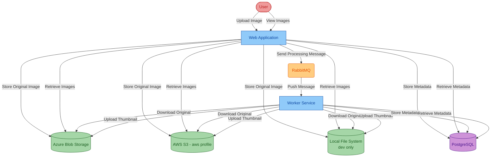

# Asset Manager
Sample project for migration tool code remediation that manages assets in cloud storage.

## Storage Options
The project supports multiple storage backends:
* **Azure Storage (Default)**: Uses Azure Blob Storage with managed identity authentication
* **AWS S3**: Uses AWS S3 with access key/secret key authentication (activate with `aws` profile)  
* **Local File System**: For development only (activate with `dev` profile)

## Current Infrastructure
The project currently uses the following infrastructure:
* Azure Blob Storage for image storage, using managed identity authentication (Default)
* AWS S3 for image storage, using password-based authentication (when using `aws` profile)
* RabbitMQ for message queuing, using password-based authentication
* PostgreSQL database for metadata storage, using password-based authentication

## Current Architecture

```mermaid
flowchart TD

%% Applications
WebApp[Web Application]
Worker[Worker Service]

%% Storage Components
AzBlob[(Azure Blob Storage)]
S3[(AWS S3 - aws profile)]
LocalFS[("Local File System<br/>dev only")]

%% Message Broker
RabbitMQ(RabbitMQ)

%% Database
PostgreSQL[(PostgreSQL)]

%% User
User([User])

%% User Flow
User -->|Upload Image| WebApp
User -->|View Images| WebApp

%% Web App Flows
WebApp -->|Store Original Image| AzBlob
WebApp -->|Store Original Image| S3
WebApp -->|Store Original Image| LocalFS
WebApp -->|Send Processing Message| RabbitMQ
WebApp -->|Store Metadata| PostgreSQL
WebApp -->|Retrieve Images| AzBlob
WebApp -->|Retrieve Images| S3
WebApp -->|Retrieve Images| LocalFS
WebApp -->|Retrieve Metadata| PostgreSQL

%% RabbitMQ Flow
RabbitMQ -->|Push Message| Worker

%% Worker Flow
Worker -->|Download Original| AzBlob
Worker -->|Download Original| S3
Worker -->|Download Original| LocalFS
Worker -->|Upload Thumbnail| AzBlob
Worker -->|Upload Thumbnail| S3
Worker -->|Upload Thumbnail| LocalFS
Worker -->|Store Metadata| PostgreSQL
Worker -->|Retrieve Metadata| PostgreSQL

%% Styling
classDef app fill:#90caf9,stroke:#0d47a1,color:#0d47a1
classDef storage fill:#a5d6a7,stroke:#1b5e20,color:#1b5e20
classDef broker fill:#ffcc80,stroke:#e65100,color:#e65100
classDef db fill:#ce93d8,stroke:#4a148c,color:#4a148c
classDef queue fill:#fff59d,stroke:#f57f17,color:#f57f17
classDef user fill:#ef9a9a,stroke:#b71c1c,color:#b71c1c

class WebApp,Worker app
class AzBlob,S3,LocalFS storage
class RabbitMQ broker
class PostgreSQL db
class Queue,RetryQueue queue
class User user
```
Azure Storage (default) with managed identity authentication, AWS S3 (aws profile) with password-based authentication

## Migrated Infrastructure
The project now supports the following Azure services:
* Azure Blob Storage for image storage, using managed identity authentication (default)
* RabbitMQ for message queuing, using password-based authentication
* PostgreSQL database for metadata storage, using password-based authentication

Legacy AWS S3 support is maintained through the `aws` profile.

## Migrated Architecture

```mermaid
flowchart TD

%% Applications
WebApp[Web Application]
Worker[Worker Service]

%% Azure Storage Components
AzBlob[(Azure Blob Storage)]
LocalFS[("Local File System<br/>dev only")]

%% Azure Message Broker
ServiceBus(Azure Service Bus)

%% Azure Database
AzPostgreSQL[(Azure PostgreSQL)]

%% User
User([User])

%% User Flow
User -->|Upload Image| WebApp
User -->|View Images| WebApp

%% Web App Flows
WebApp -->|Store Original Image| AzBlob
WebApp -->|Store Original Image| LocalFS
WebApp -->|Send Processing Message| ServiceBus
WebApp -->|Store Metadata| AzPostgreSQL
WebApp -->|Retrieve Images| AzBlob
WebApp -->|Retrieve Images| LocalFS
WebApp -->|Retrieve Metadata| AzPostgreSQL

%% Service Bus Flow
ServiceBus -->|Push Message| Worker

%% Worker Flow
Worker -->|Download Original| AzBlob
Worker -->|Download Original| LocalFS
Worker -->|Upload Thumbnail| AzBlob
Worker -->|Upload Thumbnail| LocalFS
Worker -->|Store Metadata| AzPostgreSQL
Worker -->|Retrieve Metadata| AzPostgreSQL

%% Styling
classDef app fill:#90caf9,stroke:#0d47a1,color:#0d47a1
classDef storage fill:#68B3A1,stroke:#006064,color:#006064
classDef broker fill:#B39DDB,stroke:#4527A0,color:#4527A0
classDef db fill:#90CAF9,stroke:#1565C0,color:#1565C0
classDef queue fill:#fff59d,stroke:#f57f17,color:#f57f17
classDef user fill:#ef9a9a,stroke:#b71c1c,color:#b71c1c

class WebApp,Worker app
class AzBlob,LocalFS storage
class ServiceBus broker
class AzPostgreSQL db
class Queue,RetryQueue queue
class User user
```
Managed identity based authentication

## Run Locally

**Prerequisites**: JDK, Docker

### Configuration

The application supports multiple storage backends configured through Spring profiles:

#### Azure Storage (Default)
```properties
# Azure Storage Configuration
azure.storage.account.endpoint=https://yourstorageaccount.blob.core.windows.net
azure.storage.container.name=your-container-name
```

To use Azure Storage, ensure the application has access to Azure credentials through:
- Azure CLI: `az login`
- Managed Identity (when running on Azure)
- Environment variables: `AZURE_CLIENT_ID`, `AZURE_CLIENT_SECRET`, `AZURE_TENANT_ID`

#### AWS S3 (Legacy)
Activate the `aws` profile to use AWS S3:
```properties
# AWS S3 Configuration
aws.accessKey=your-access-key
aws.secretKey=your-secret-key
aws.region=us-east-1
aws.s3.bucket=your-bucket-name
```

#### Local Development
Activate the `dev` profile to use local file system storage.

### Running the Application

Run the following commands to start the apps locally. This will:
* Use local file system instead of cloud storage (when using `dev` profile)
* Launch RabbitMQ and PostgreSQL using Docker

Windows:

```batch
cd asset-manager
scripts\start.cmd
```

Linux:

```sh
cd asset-manager
scripts/start.sh
```

To stop, run `stop.cmd` or `stop.sh` in the `scripts` directory.

### Migration from S3 to Azure Storage

This project has been migrated from AWS S3 to Azure Storage Account. The migration includes:

1. **Dependencies**: Added Azure Storage Blob, Azure Identity libraries
2. **Configuration**: Added Azure Storage configuration alongside AWS S3 configuration
3. **Services**: Created Azure Storage service implementations
4. **Profiles**: 
   - Default: Uses Azure Storage with managed identity
   - `aws`: Uses AWS S3 with access key/secret key authentication
   - `dev`: Uses local file system

To switch between storage backends:
- **Azure Storage**: Run without any profile (default)
- **AWS S3**: Run with `--spring.profiles.active=aws`
- **Local Storage**: Run with `--spring.profiles.active=dev`