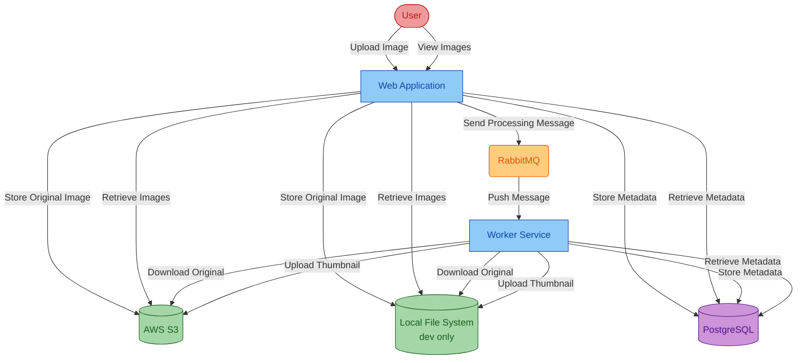

# Asset Manager
Sample project for migration tool code remediation that manages assets in cloud storage.

## Current Infrastructure
The project currently uses the following infrastructure:
* AWS S3 for image storage, using password-based authentication (access key/secret key)
* RabbitMQ for message queuing, using password-based authentication
* PostgreSQL database for metadata storage, using password-based authentication

## Current Architecture

```mermaid
flowchart TD

%% Applications
WebApp[Web Application]
Worker[Worker Service]

%% Storage Components
S3[(AWS S3)]
LocalFS[("Local File System<br/>dev only")]

%% Message Broker
RabbitMQ(RabbitMQ)

%% Database
PostgreSQL[(PostgreSQL)]

%% User
User([User])

%% User Flow
User -->|Upload Image| WebApp
User -->|View Images| WebApp

%% Web App Flows
WebApp -->|Store Original Image| S3
WebApp -->|Store Original Image| LocalFS
WebApp -->|Send Processing Message| RabbitMQ
WebApp -->|Store Metadata| PostgreSQL
WebApp -->|Retrieve Images| S3
WebApp -->|Retrieve Images| LocalFS
WebApp -->|Retrieve Metadata| PostgreSQL

%% RabbitMQ Flow
RabbitMQ -->|Push Message| Worker

%% Worker Flow
Worker -->|Download Original| S3
Worker -->|Download Original| LocalFS
Worker -->|Upload Thumbnail| S3
Worker -->|Upload Thumbnail| LocalFS
Worker -->|Store Metadata| PostgreSQL
Worker -->|Retrieve Metadata| PostgreSQL

%% Styling
classDef app fill:#90caf9,stroke:#0d47a1,color:#0d47a1
classDef storage fill:#a5d6a7,stroke:#1b5e20,color:#1b5e20
classDef broker fill:#ffcc80,stroke:#e65100,color:#e65100
classDef db fill:#ce93d8,stroke:#4a148c,color:#4a148c
classDef queue fill:#fff59d,stroke:#f57f17,color:#f57f17
classDef user fill:#ef9a9a,stroke:#b71c1c,color:#b71c1c

class WebApp,Worker app
class S3,LocalFS storage
class RabbitMQ broker
class PostgreSQL db
class Queue,RetryQueue queue
class User user
```
Password-based authentication

## Migrated Infrastructure
After migration, the project will use the following Azure services:
* Azure Blob Storage for image storage, using managed identity authentication
* Azure Service Bus for message queuing, using managed identity authentication
* Azure Database for PostgreSQL for metadata storage, using managed identity authentication

## Migrated Architecture

```mermaid
flowchart TD

%% Applications
WebApp[Web Application]
Worker[Worker Service]

%% Azure Storage Components
AzBlob[(Azure Blob Storage)]
LocalFS[("Local File System<br/>dev only")]

%% Azure Message Broker
ServiceBus(Azure Service Bus)

%% Azure Database
AzPostgreSQL[(Azure PostgreSQL)]

%% User
User([User])

%% User Flow
User -->|Upload Image| WebApp
User -->|View Images| WebApp

%% Web App Flows
WebApp -->|Store Original Image| AzBlob
WebApp -->|Store Original Image| LocalFS
WebApp -->|Send Processing Message| ServiceBus
WebApp -->|Store Metadata| AzPostgreSQL
WebApp -->|Retrieve Images| AzBlob
WebApp -->|Retrieve Images| LocalFS
WebApp -->|Retrieve Metadata| AzPostgreSQL

%% Service Bus Flow
ServiceBus -->|Push Message| Worker

%% Worker Flow
Worker -->|Download Original| AzBlob
Worker -->|Download Original| LocalFS
Worker -->|Upload Thumbnail| AzBlob
Worker -->|Upload Thumbnail| LocalFS
Worker -->|Store Metadata| AzPostgreSQL
Worker -->|Retrieve Metadata| AzPostgreSQL

%% Styling
classDef app fill:#90caf9,stroke:#0d47a1,color:#0d47a1
classDef storage fill:#68B3A1,stroke:#006064,color:#006064
classDef broker fill:#B39DDB,stroke:#4527A0,color:#4527A0
classDef db fill:#90CAF9,stroke:#1565C0,color:#1565C0
classDef queue fill:#fff59d,stroke:#f57f17,color:#f57f17
classDef user fill:#ef9a9a,stroke:#b71c1c,color:#b71c1c

class WebApp,Worker app
class AzBlob,LocalFS storage
class ServiceBus broker
class AzPostgreSQL db
class Queue,RetryQueue queue
class User user
```
Managed identity based authentication

## Run Locally

**Prerequisites**: JDK 21, Docker

Run the following commands to start the apps locally. This will:
* Use local file system instead of S3/Azure Blob to store the image
* Launch RabbitMQ and PostgreSQL using Docker

Windows:

```batch
cd asset-manager
scripts\start.cmd
```

Linux:

```sh
cd asset-manager
scripts/start.sh
```

To stop, run `stop.cmd` or `stop.sh` in the `scripts` directory.

## Deployment Options

### Deploy to AWS
The application can run on AWS using S3 for storage and RabbitMQ for messaging:
- Set profile to `prod` or leave as default
- Configure AWS credentials and S3 bucket
- Deploy web and worker modules

### Deploy to Azure
The application supports Azure deployment with managed identity authentication:
- Set profile to `azure`
- Configure Azure Blob Storage and Service Bus
- Enable managed identity on Azure App Service/Container Apps
- Assign required RBAC roles

See the [Migration Guide](.github/modernization/001-modernization-plan/MIGRATION_GUIDE.md) for detailed Azure deployment instructions.

## Azure Migration

The project has been modernized to support Azure services with managed identity authentication. Key changes:

### ✅ Completed
- **Java 21 LTS**: Upgraded from Java 17
- **Spring Boot 3.4.2**: Upgraded from 3.2.1
- **Azure Blob Storage**: Integrated with managed identity
- **Azure Service Bus**: Integrated with JMS API
- **Profile-based deployment**: `dev`, `prod`, and `azure` profiles

### 📚 Documentation
- [Modernization Plan](.github/modernization/001-modernization-plan/PLAN.md)
- [Execution Summary](.github/modernization/001-modernization-plan/EXECUTION_SUMMARY.md)
- [Migration Guide](.github/modernization/001-modernization-plan/MIGRATION_GUIDE.md)

## Building the Application

**Prerequisites**: JDK 21, Maven

```bash
# Set Java 21 as active JDK
export JAVA_HOME=/usr/lib/jvm/temurin-21-jdk-amd64
export PATH=$JAVA_HOME/bin:$PATH

# Build the project
./mvnw clean install

# Run tests
./mvnw test
```

## Running with Different Profiles

### Local Development (dev)
```bash
./mvnw spring-boot:run -Dspring-boot.run.profiles=dev
```

### AWS Deployment (prod)
```bash
java -jar -Dspring.profiles.active=prod web/target/assets-manager-web-0.0.1-SNAPSHOT.jar
```

### Azure Deployment
```bash
java -jar -Dspring.profiles.active=azure web/target/assets-manager-web-0.0.1-SNAPSHOT.jar
```