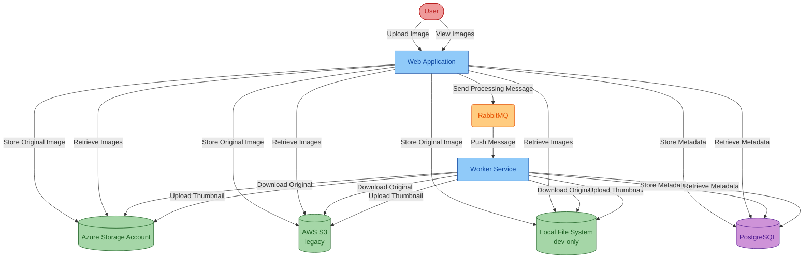
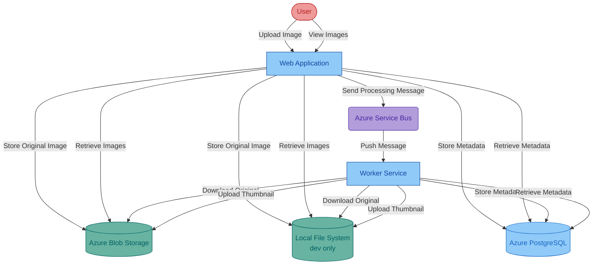

# Asset Manager
Sample project for migration tool code remediation that manages assets in cloud storage.

## Current Infrastructure
The project has been migrated to use the following infrastructure:
* **Azure Storage Account** for image storage, using managed identity authentication (default)
* **AWS S3** for image storage, using password-based authentication (legacy, via `aws` profile)
* **RabbitMQ** for message queuing, using password-based authentication  
* **PostgreSQL** database for metadata storage, using password-based authentication

## Current Architecture

```mermaid
flowchart TD

%% Applications
WebApp[Web Application]
Worker[Worker Service]

%% Storage Components
AzureBlob[(Azure Storage Account)]
S3[(AWS S3<br/>legacy)]
LocalFS[("Local File System<br/>dev only")]

%% Message Broker
RabbitMQ(RabbitMQ)

%% Database
PostgreSQL[(PostgreSQL)]

%% User
User([User])

%% User Flow
User -->|Upload Image| WebApp
User -->|View Images| WebApp

%% Web App Flows
WebApp -->|Store Original Image| AzureBlob
WebApp -->|Store Original Image| S3
WebApp -->|Store Original Image| LocalFS
WebApp -->|Send Processing Message| RabbitMQ
WebApp -->|Store Metadata| PostgreSQL
WebApp -->|Retrieve Images| AzureBlob
WebApp -->|Retrieve Images| S3
WebApp -->|Retrieve Images| LocalFS
WebApp -->|Retrieve Metadata| PostgreSQL

%% RabbitMQ Flow
RabbitMQ -->|Push Message| Worker

%% Worker Flow
Worker -->|Download Original| AzureBlob
Worker -->|Download Original| S3
Worker -->|Download Original| LocalFS
Worker -->|Upload Thumbnail| AzureBlob
Worker -->|Upload Thumbnail| S3
Worker -->|Upload Thumbnail| LocalFS
Worker -->|Store Metadata| PostgreSQL
Worker -->|Retrieve Metadata| PostgreSQL

%% Styling
classDef app fill:#90caf9,stroke:#0d47a1,color:#0d47a1
classDef storage fill:#a5d6a7,stroke:#1b5e20,color:#1b5e20
classDef broker fill:#ffcc80,stroke:#e65100,color:#e65100
classDef db fill:#ce93d8,stroke:#4a148c,color:#4a148c
classDef queue fill:#fff59d,stroke:#f57f17,color:#f57f17
classDef user fill:#ef9a9a,stroke:#b71c1c,color:#b71c1c

class WebApp,Worker app
class AzureBlob,S3,LocalFS storage
class RabbitMQ broker
class PostgreSQL db
class Queue,RetryQueue queue
class User user
```
Password-based authentication

## Migrated Infrastructure
After migration, the project will use the following Azure services:
* Azure Blob Storage for image storage, using managed identity authentication
* Azure Service Bus for message queuing, using managed identity authentication
* Azure Database for PostgreSQL for metadata storage, using managed identity authentication

## Migrated Architecture

```mermaid
flowchart TD

%% Applications
WebApp[Web Application]
Worker[Worker Service]

%% Azure Storage Components
AzBlob[(Azure Blob Storage)]
LocalFS[("Local File System<br/>dev only")]

%% Azure Message Broker
ServiceBus(Azure Service Bus)

%% Azure Database
AzPostgreSQL[(Azure PostgreSQL)]

%% User
User([User])

%% User Flow
User -->|Upload Image| WebApp
User -->|View Images| WebApp

%% Web App Flows
WebApp -->|Store Original Image| AzBlob
WebApp -->|Store Original Image| LocalFS
WebApp -->|Send Processing Message| ServiceBus
WebApp -->|Store Metadata| AzPostgreSQL
WebApp -->|Retrieve Images| AzBlob
WebApp -->|Retrieve Images| LocalFS
WebApp -->|Retrieve Metadata| AzPostgreSQL

%% Service Bus Flow
ServiceBus -->|Push Message| Worker

%% Worker Flow
Worker -->|Download Original| AzBlob
Worker -->|Download Original| LocalFS
Worker -->|Upload Thumbnail| AzBlob
Worker -->|Upload Thumbnail| LocalFS
Worker -->|Store Metadata| AzPostgreSQL
Worker -->|Retrieve Metadata| AzPostgreSQL

%% Styling
classDef app fill:#90caf9,stroke:#0d47a1,color:#0d47a1
classDef storage fill:#68B3A1,stroke:#006064,color:#006064
classDef broker fill:#B39DDB,stroke:#4527A0,color:#4527A0
classDef db fill:#90CAF9,stroke:#1565C0,color:#1565C0
classDef queue fill:#fff59d,stroke:#f57f17,color:#f57f17
classDef user fill:#ef9a9a,stroke:#b71c1c,color:#b71c1c

class WebApp,Worker app
class AzBlob,LocalFS storage
class ServiceBus broker
class AzPostgreSQL db
class Queue,RetryQueue queue
class User user
```
Managed identity based authentication

## Configuration Profiles

The application supports multiple configuration profiles:

### Default Profile (Azure Storage + RabbitMQ)
```bash
./mvnw spring-boot:run
# or
java -jar target/assets-manager-web-0.0.1-SNAPSHOT.jar
```

**Configuration:**
- Storage: Azure Storage Account with managed identity
- Messaging: RabbitMQ
- Database: PostgreSQL

### AWS Profile (Legacy)
```bash
./mvnw spring-boot:run -Dspring-boot.run.profiles=aws
# or  
java -jar target/assets-manager-web-0.0.1-SNAPSHOT.jar --spring.profiles.active=aws
```

**Configuration:**
- Storage: AWS S3 with access key/secret
- Messaging: RabbitMQ
- Database: PostgreSQL

### Development Profile
```bash
./mvnw spring-boot:run -Dspring-boot.run.profiles=dev
# or
java -jar target/assets-manager-web-0.0.1-SNAPSHOT.jar --spring.profiles.active=dev
```

**Configuration:**
- Storage: Local file system
- Messaging: RabbitMQ
- Database: PostgreSQL

## Run Locally

**Prerequisites**: JDK, Docker

Run the following commands to start the apps locally. This will:
* Use local file system instead of S3 to store the image
* Launch RabbitMQ and PostgreSQL using Docker

Windows:

```batch
cd asset-manager
scripts\start.cmd
```

Linux:

```sh
cd asset-manager
scripts/start.sh
```

To stop, run `stop.cmd` or `stop.sh` in the `scripts` directory.